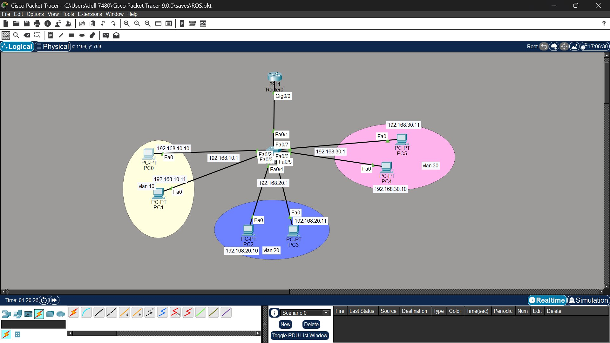
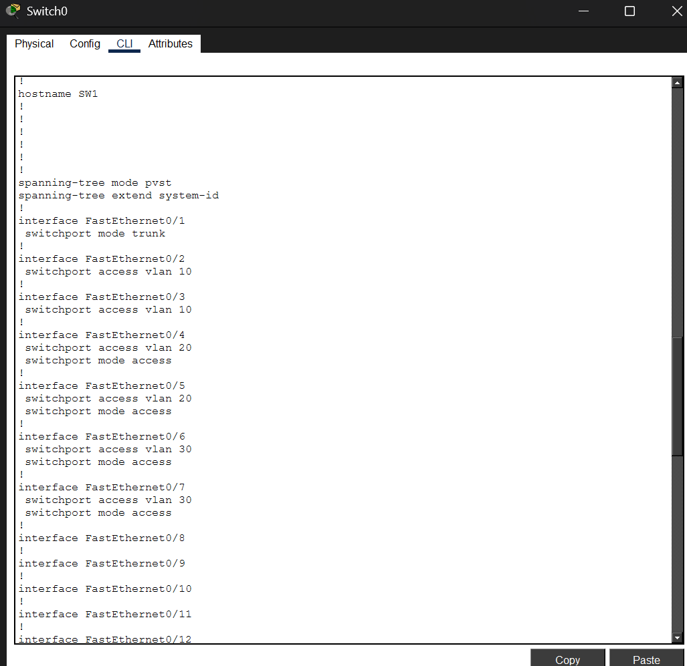
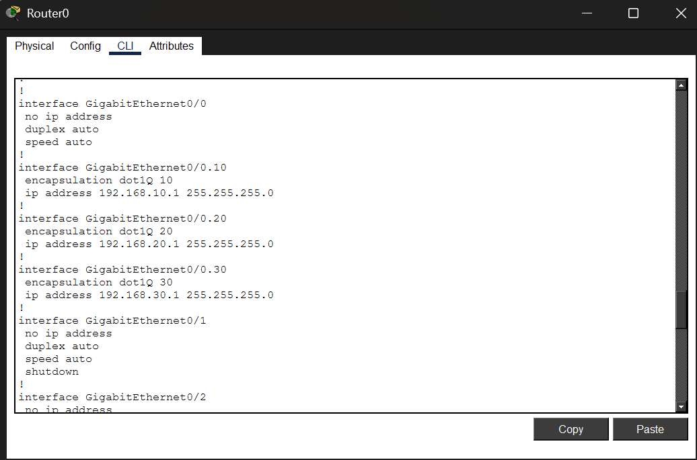
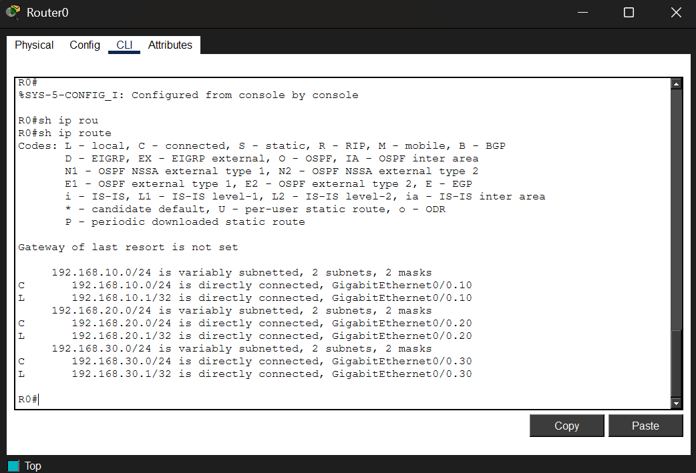
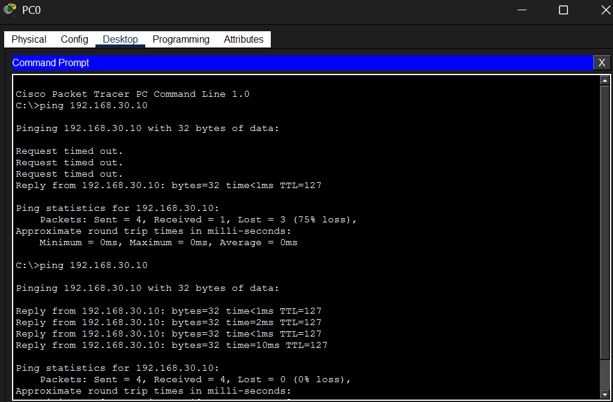

# Lab 04 — Inter-VLAN Routing Using Router-on-a-Stick (ROAS)

**Platform:** Cisco Packet Tracer
**Difficulty:** Intermediate
**Topics:** Router-on-a-Stick · Subinterfaces · 802.1Q Encapsulation · Trunking · Inter-VLAN Routing

---

## Objective

Configure inter-VLAN routing using a single router connected to a Layer-2 switch via
one physical interface. Create router subinterfaces for each VLAN, configure 802.1Q
encapsulation, and verify that all three VLANs can communicate through the router.

---

## Topology



> Router0 (Cisco 2911) connected to Switch0 (Cisco 2960-24TT) via a single Gi0/0 ↔
> Fa0/1 trunk link (dot1Q). All inter-VLAN traffic travels up and back down this
> single physical link — the Router-on-a-Stick design.

```
              Router0
              (2911)
               G0/0
                |
                | Gi0/0 -- Fa0/1 (Trunk dot1Q)
              Fa0/1
               Switch0
              (2960-24TT)
    ____________________________________________

   Fa0/2  Fa0/3  Fa0/4  Fa0/5  Fa0/6  Fa0/7
     |      |      |      |      |      |
    PC0    PC1    PC2    PC3    PC4    PC5

   VLAN10 VLAN10 VLAN20 VLAN20 VLAN30 VLAN30
```

---

## Device Connections

| Device  | Port   | Connected To | Port   | VLAN  |
|---------|--------|--------------|--------|-------|
| Router0 | Gi0/0  | Switch0      | Fa0/1  | Trunk |
| Switch0 | Fa0/2  | PC0          | Fa0    | 10    |
| Switch0 | Fa0/3  | PC1          | Fa0    | 10    |
| Switch0 | Fa0/4  | PC2          | Fa0    | 20    |
| Switch0 | Fa0/5  | PC3          | Fa0    | 20    |
| Switch0 | Fa0/6  | PC4          | Fa0    | 30    |
| Switch0 | Fa0/7  | PC5          | Fa0    | 30    |

---

## IP Addressing

| Device   | IP Address     | Subnet Mask     | Gateway       | VLAN |
|----------|----------------|-----------------|---------------|------|
| PC0      | 192.168.10.10  | 255.255.255.0   | 192.168.10.1  | 10   |
| PC1      | 192.168.10.11  | 255.255.255.0   | 192.168.10.1  | 10   |
| PC2      | 192.168.20.10  | 255.255.255.0   | 192.168.20.1  | 20   |
| PC3      | 192.168.20.11  | 255.255.255.0   | 192.168.20.1  | 20   |
| PC4      | 192.168.30.10  | 255.255.255.0   | 192.168.30.1  | 30   |
| PC5      | 192.168.30.11  | 255.255.255.0   | 192.168.30.1  | 30   |
| Gi0/0.10 | 192.168.10.1   | 255.255.255.0   | —             | 10   |
| Gi0/0.20 | 192.168.20.1   | 255.255.255.0   | —             | 20   |
| Gi0/0.30 | 192.168.30.1   | 255.255.255.0   | —             | 30   |

---

## Key Concepts

**Why Router-on-a-Stick?** A standard Layer-2 switch cannot route between VLANs.
Adding a router provides Layer 3 routing without needing an expensive Layer-3 switch.
The router uses a single physical interface with multiple logical subinterfaces — one
per VLAN — hence the name Router-on-a-Stick.

**Subinterface** is a logical division of a physical router interface. Each subinterface
acts as the default gateway for one VLAN. The physical interface carries all VLAN traffic
simultaneously using 802.1Q tags to separate each VLAN's frames.

**`encapsulation dot1Q [vlan-id]`** tells the subinterface which VLAN tag to look for
on incoming frames and which tag to apply to outgoing frames. Without this, the
subinterface cannot distinguish between VLANs.

**Why the physical interface has no IP address:** G0/0 is the carrier only. All IP
addresses live on the subinterfaces. Assigning an IP to G0/0 itself creates a conflict
with the subinterface design.

**ROAS vs SVI:**

| | Router-on-a-Stick | SVI (Layer-3 Switch) |
|--|--|--|
| Device needed | Router + Layer-2 switch | Layer-3 switch only |
| Performance | Lower — all traffic through one link | Higher — hardware switching |
| Cost | Lower for small setups | Higher upfront |
| Use case | Small networks, labs | Enterprise networks |

---

## Packet Tracer File

[Download: inter-vlan-routing-ros.pkt](inter-vlan-routing-ros.pkt)

Open this file in Cisco Packet Tracer to follow along or test the configuration.

---

## Configuration Steps

---

### STEP 1 — Create VLANs on Switch0

```
Switch0# configure terminal
Switch0(config)# vlan 10
Switch0(config-vlan)# name SALES
Switch0(config)# vlan 20
Switch0(config-vlan)# name HR
Switch0(config)# vlan 30
Switch0(config-vlan)# name ACCOUNTS
Switch0(config)# exit
```

---

### STEP 2 — Assign Access Ports

```
Switch0(config)# interface range fa0/2-3
Switch0(config-if-range)# switchport mode access
Switch0(config-if-range)# switchport access vlan 10
Switch0(config-if-range)# exit

Switch0(config)# interface range fa0/4-5
Switch0(config-if-range)# switchport mode access
Switch0(config-if-range)# switchport access vlan 20
Switch0(config-if-range)# exit

Switch0(config)# interface range fa0/6-7
Switch0(config-if-range)# switchport mode access
Switch0(config-if-range)# switchport access vlan 30
Switch0(config-if-range)# exit
```

---

### STEP 3 — Configure Trunk to Router

```
Switch0(config)# interface fa0/1
Switch0(config-if)# switchport mode trunk
Switch0(config-if)# exit
```

> This is critical. If Fa0/1 is left in access mode it can only carry one VLAN —
> the router sees traffic for that VLAN only and cannot route the others.



> Confirms the hostname is **SW1**, with Fa0/1 as a trunk, Fa0/2-3 in VLAN 10,
> Fa0/4-5 in VLAN 20, and Fa0/6-7 in VLAN 30 — matching the Device Connections
> table above exactly.

---

### STEP 4 — Verify Switch Configuration

```
Switch0# show vlan brief
```

Expected:
```
VLAN  Name      Status    Ports
10    SALES     active    Fa0/2, Fa0/3
20    HR        active    Fa0/4, Fa0/5
30    ACCOUNTS  active    Fa0/6, Fa0/7
```

```
Switch0# show interfaces trunk
```

Expected:
```
Port    Mode    Encapsulation  Status    VLANs Allowed
Fa0/1   on      802.1q         trunking  1,10,20,30
```

---

### STEP 5 — Bring Up Router Physical Interface

```
Router0# configure terminal
Router0(config)# interface g0/0
Router0(config-if)# no shutdown
Router0(config-if)# exit
```

> Do NOT assign an IP address to G0/0 itself. Just bring it up with `no shutdown`.
> All IP addresses go on the subinterfaces.

---

### STEP 6 — Create Subinterface for VLAN 10

```
Router0(config)# interface g0/0.10
Router0(config-subif)# encapsulation dot1Q 10
Router0(config-subif)# ip address 192.168.10.1 255.255.255.0
Router0(config-subif)# exit
```

> `g0/0.10` — convention is to match the subinterface number to the VLAN ID.
> `encapsulation dot1Q 10` — this subinterface handles frames tagged with VLAN 10.

---

### STEP 7 — Create Subinterface for VLAN 20

```
Router0(config)# interface g0/0.20
Router0(config-subif)# encapsulation dot1Q 20
Router0(config-subif)# ip address 192.168.20.1 255.255.255.0
Router0(config-subif)# exit
```

---

### STEP 8 — Create Subinterface for VLAN 30

```
Router0(config)# interface g0/0.30
Router0(config-subif)# encapsulation dot1Q 30
Router0(config-subif)# ip address 192.168.30.1 255.255.255.0
Router0(config-subif)# exit
```



> Confirms G0/0 has `no ip address` (carrier only), and all three subinterfaces
> (.10, .20, .30) have the correct `encapsulation dot1Q` and IP address matching
> the IP Addressing table.

---

### STEP 9 — Verify Router Interfaces

```
Router0# show ip interface brief
```

Expected:
```
Interface      IP-Address      OK?  Status   Protocol
Gig0/0         unassigned      YES  up       up
Gig0/0.10      192.168.10.1    YES  up       up
Gig0/0.20      192.168.20.1    YES  up       up
Gig0/0.30      192.168.30.1    YES  up       up
```

> If any subinterface shows down, check that the physical G0/0 is up first.
> Subinterfaces inherit the physical interface state — if G0/0 is down, all
> subinterfaces are down regardless of their own configuration.

---

### STEP 10 — Verify Routing Table

```
Router0# show ip route
```

Expected:
```
C   192.168.10.0/24 is directly connected, GigabitEthernet0/0.10
C   192.168.20.0/24 is directly connected, GigabitEthernet0/0.20
C   192.168.30.0/24 is directly connected, GigabitEthernet0/0.30
```



> Routing table on R0 confirms all three VLAN subnets (10, 20, 30) are directly
> connected through their respective subinterfaces — `C` and `L` entries present
> for each, with "Gateway of last resort is not set" since this is the edge of
> the topology.

---

### STEP 11 — Connectivity Tests

| Test           | From                      | To  | Expected   |
|----------------|---------------------------|-----|------------|
| Same VLAN      | PC0 `ping 192.168.10.11`  | PC1 | ✅ Success |
| VLAN 10 → 20  | PC0 `ping 192.168.20.10`  | PC2 | ✅ Success |
| VLAN 10 → 30  | PC0 `ping 192.168.30.10`  | PC4 | ✅ Success |
| VLAN 20 → 30  | PC2 `ping 192.168.30.10`  | PC4 | ✅ Success |
| VLAN 30 → 10  | PC5 `ping 192.168.10.10`  | PC0 | ✅ Success |



> PC0 (VLAN 10) pinging 192.168.30.10 (PC4, VLAN 30). First three packets time
> out — normal ARP resolution delay on the first cross-VLAN request — then the
> fourth packet succeeds. Second ping attempt shows all four packets succeeding
> with 0% loss, confirming the router subinterfaces are correctly routing
> between VLAN 10 and VLAN 30.

---

## How Traffic Flows (PC0 to PC2)

```
PC0 (192.168.10.10, VLAN 10)
  → destination 192.168.20.10 is in a different subnet
  → sends frame to default gateway 192.168.10.1
  → Switch0 tags frame VLAN 10, forwards up trunk Fa0/1
  → Router Gi0/0.10 receives VLAN 10 tagged frame, strips tag
  → Router checks routing table: 192.168.20.0/24 → Gi0/0.20
  → Router tags frame VLAN 20, sends out Gi0/0.20
  → Switch0 receives VLAN 20 tagged frame on trunk Fa0/1
  → Switch0 strips tag, forwards to PC2 on Fa0/4
```

All traffic physically crosses the same cable twice — this is the ROAS bottleneck.

---

## Troubleshooting

| Problem | Symptom | Cause | Fix |
|---------|---------|-------|-----|
| VLANs cannot communicate | Ping fails across VLANs | Switch Fa0/1 in access mode | `switchport mode trunk` on Fa0/1 |
| Subinterface down | `show ip int brief` shows down | Physical G0/0 not brought up | `interface g0/0` → `no shutdown` |
| Wrong VLAN routed | Traffic goes to wrong host | Wrong VLAN ID in `encapsulation dot1Q` | Verify VLAN ID matches the subinterface number |
| Destination unreachable | PC cannot reach gateway | Wrong default gateway configured | Set gateway to correct subinterface IP |

---

## Verification Summary

| Command                   | Where   | What to Confirm                         |
|---------------------------|---------|-----------------------------------------|
| `show vlan brief`         | Switch0 | VLANs 10, 20, 30 with correct ports    |
| `show interfaces trunk`   | Switch0 | Fa0/1 trunking, VLANs 10/20/30 allowed |
| `show ip interface brief` | Router0 | G0/0 up, all subinterfaces up/up        |
| `show ip route`           | Router0 | Three connected routes present          |
| `ping 192.168.30.10`      | PC0     | Cross-VLAN success                      |

---

## Running Configuration Reference

The HTML file `show-running-config-ros-lab.html` contains the full `show running-config`
output for Router0 and Switch0 with syntax highlighting and a tabbed interface.

Key observations from the running config:

- Router0 has three subinterfaces (G0/0.10, G0/0.20, G0/0.30) — G0/0 itself has no IP
- `encapsulation dot1Q` is explicitly set on each subinterface with the correct VLAN ID
- Switch0 Fa0/1 has `switchport mode trunk` — no encapsulation command needed on 2960
- VLAN names in Switch0 config: SALES (10), HR (20), ACCOUNTS (30)
- Vlan1 is explicitly shut on Switch0 — management VLAN disabled
- G0/1 and G0/2 on the router are shut — only G0/0 is used

---

## Lessons Learned

- The physical router interface must be brought up with `no shutdown` — never assign an IP to it
- Subinterface numbers do not have to match VLAN IDs but matching them is universal best practice
- `encapsulation dot1Q` is mandatory on every subinterface — without it the subinterface ignores VLAN tags
- The switch port connected to the router must be a trunk — access mode breaks routing for all other VLANs
- All ROAS traffic physically crosses the same cable twice — this is its performance bottleneck vs SVI
- For enterprise or high-throughput networks, SVI routing on a Layer-3 switch is always preferred
