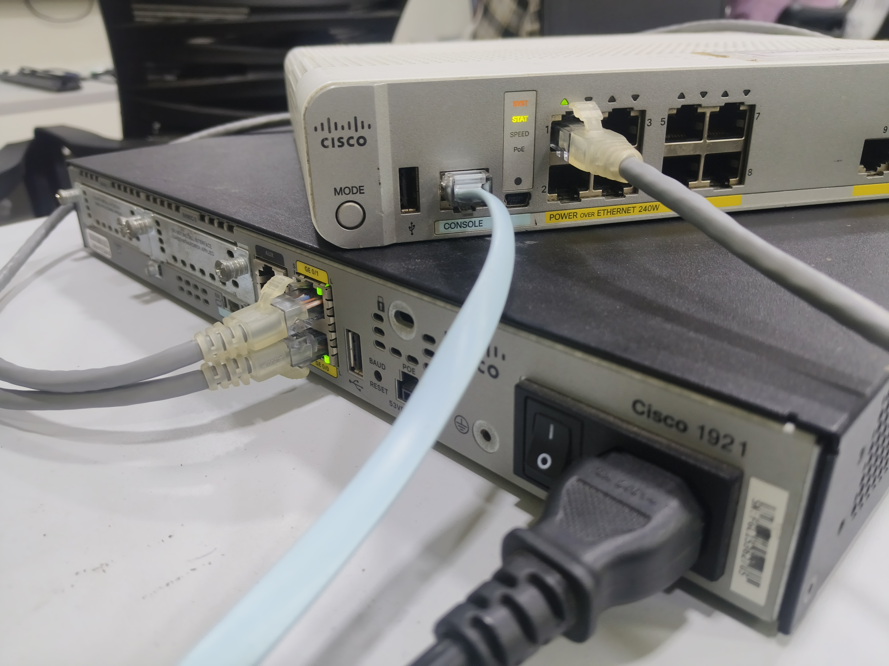

# Cisco Real Hardware Labs

Most networking labs happen inside Packet Tracer — a software simulator where
nothing can really go wrong in a way that surprises you. You type the commands,
the virtual devices respond predictably, and you move on.

These labs are different. This is a physical Cisco 1921 ISR router and a Cisco
Catalyst 3560-CX Layer 3 switch, console cable plugged in, PuTTY open on COM4,
and real upstream internet connectivity that either works or doesn't. The kind of
environment where the interface stays down because you forgot `no shutdown`, where
NAT silently drops your packets with no error message, and where your ACL testing
methodology turns out to be wrong in a way that took a while to figure out.

Both of those things happened here. They're documented.

---

## The Two Volumes

**[Vol 01 — Router Baseline](Vol_01_Router_Baseline/)**

Start from a factory-reset 1921. Build it into a working internet gateway — WAN and
LAN interfaces, NAT overload, SSH with a 2048-bit RSA key, Telnet, a live PC getting
internet through it. The whole thing done over a console cable, verified step by step
before moving on.

**[Vol 02 — Enterprise Switch: VLANs, DHCP, ACL Security](Vol_02_Enterprise_Switch/)**

The router from Vol 01 stays as the WAN edge. A Catalyst 3560-CX gets attached and
takes over everything internal — VLANs, inter-VLAN routing via SVIs, DHCP for four
separate departments, then an extended ACL policy to isolate them from each other.
Plus the two real issues encountered during the build, and the troubleshooting that
found them.

---

## Hardware

- **Router:** Cisco 1921 ISR — IOS 15.1, GE0/0 and GE0/1
- **Switch:** Cisco Catalyst 3560-CX — IOS 15.2, Layer 3 capable, Rapid PVST+
- **Access method:** Console cable (Cisco rollover) → USB-serial → PuTTY on COM4/COM5
- **Location:** Vatanix Technologies, Trichy

