# Vol 01 — Router Baseline

**Hardware:** Cisco 1921 ISR
**Access:** Console cable → PuTTY (COM4)
**Goal:** Build a working internet gateway from scratch on real hardware

---

The first thing you notice when you open a PuTTY serial session to a real router
is that it feels different from Packet Tracer. The terminal is slower. The RSA key
generation actually takes 24 seconds — you watch the dots appear one by one. When
you plug in the LAN cable and the interface comes up, IOS logs it in real time:

```
%LINK-3-UPDOWN: Interface GigabitEthernet0/1, changed state to up
%LINEPROTO-5-UPDOWN: Line protocol on Interface GigabitEthernet0/1, changed state to up
```

That's not a simulation. That's the router detecting a physical link.

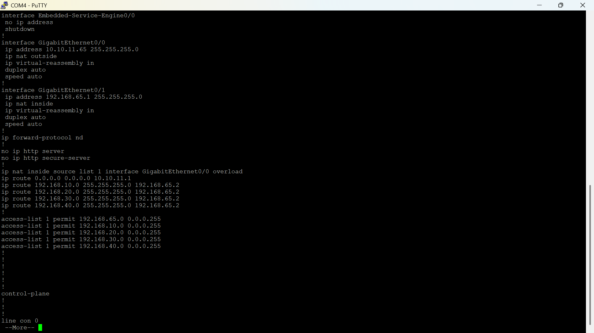
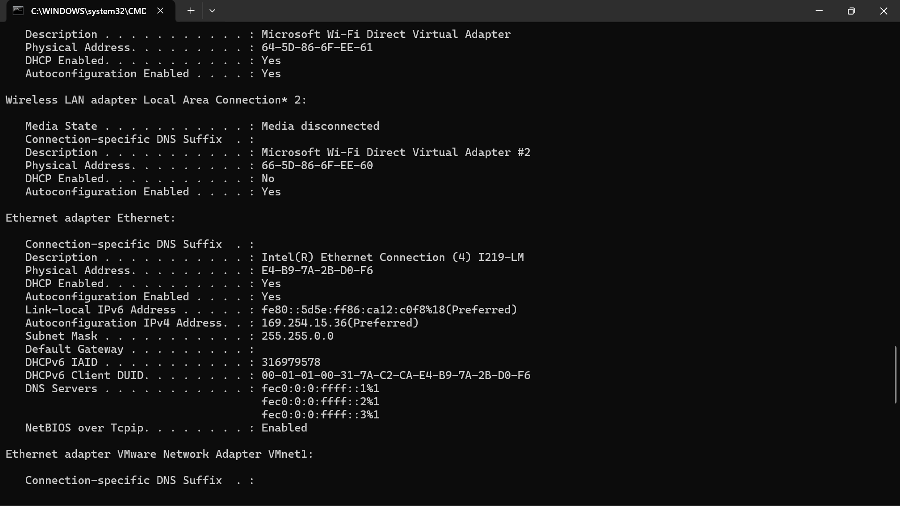
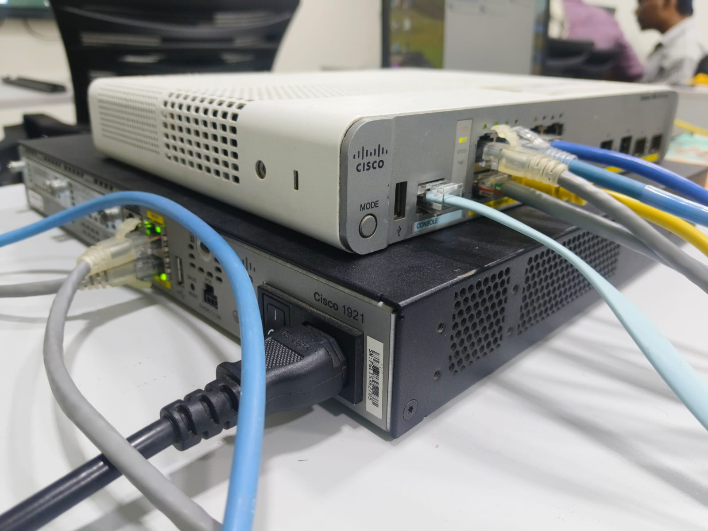

---

## The Topology

```
          Internet (real upstream)
                  │
           10.10.11.1/24
                  │
        G0/0 — 10.10.11.65/24
          ┌──────────────┐
          │  Cisco 1921  │  vtnx_R1
          └──────────────┘
        G0/1 — 192.168.65.1/24
                  │
             Test Laptop
          192.168.65.10/24
```

Simple on paper. The router sits between an upstream main router (acting as ISP) and
a single laptop. The job: get the laptop on the internet, manage the router securely
over SSH, and verify everything works before moving to Vol 02.

---

## What Was Built and Why

### Basic Hardening First

Before touching any interface, the basics go in — hostname, enable secret, console
password, password encryption, and a login banner. None of these affect connectivity,
but all of them matter. `enable secret` is hashed with MD5; `enable password` stores
the password in plain text in the running config. There's never a reason to use the
plain-text one.

```
hostname vtnx_R1
no ip domain-lookup
enable secret Cisco@123
service password-encryption
banner motd #
Unauthorized Access Prohibited
#
line console 0
 password cisco
 login
```

`no ip domain-lookup` is the one that saves you from a long pause every time you
mistype a command and IOS tries to DNS-resolve it.

### WAN Interface First, Not LAN

The order matters. Configure the WAN interface (G0/0) and mark it `ip nat outside`
before touching the LAN side. If you configure NAT inside before outside, Cisco IOS
can throw errors. It's also cleaner to build outward-in — WAN confirmed up, then LAN,
then routing, then NAT.

```
interface g0/0
 description WAN Connection
 ip address 10.10.11.65 255.255.255.0
 ip nat outside
 no shutdown
```

When you type `no shutdown` on the WAN interface, NVI0 (the NAT Virtual Interface)
comes up immediately — that's the log line `%LINEPROTO-5-UPDOWN: Line protocol on
Interface NVI0, changed state to up`. It means the interface came up and IOS
registered it with the NAT process. Normal behavior, worth knowing what it is so
it doesn't confuse you the first time you see it.

### LAN Interface

```
interface g0/1
 description LAN Network
 ip address 192.168.65.1 255.255.255.0
 ip nat inside
 no shutdown
```

### Default Route and NAT

Without a default route, the router has no idea where to send traffic it doesn't have
a specific route for — which includes everything going to the internet.

```
ip route 0.0.0.0 0.0.0.0 10.10.11.1
```

NAT overload (PAT) lets every device on the LAN share the single WAN IP. The ACL
defines which source addresses are allowed to be translated — anything not in the
permit list gets dropped at NAT silently, with no error anywhere.

```
access-list 1 permit 192.168.65.0 0.0.0.255
ip nat inside source list 1 interface g0/0 overload
```

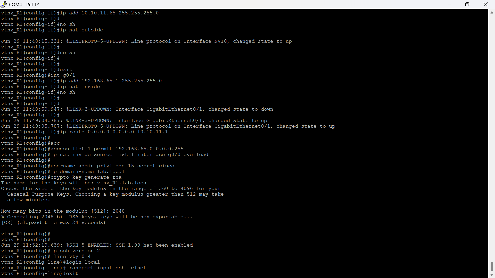
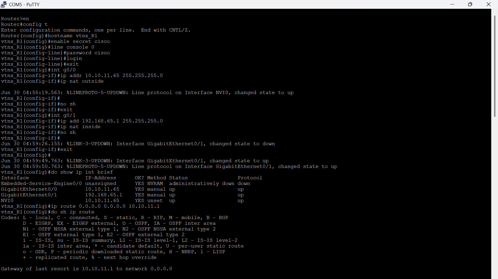

### SSH with 2048-bit RSA

Telnet is configured here too — but only as a baseline test, not as the permanent
management method. The difference matters: Telnet sends everything in plain text,
including passwords. Anyone with packet capture on the same segment can read the
session. SSH encrypts the entire session.

For SSH to work on a Cisco router, three things are mandatory before the key:

1. A domain name must be set (`ip domain-name`) — the RSA key pair is named
   `hostname.domainname`
2. A local username must exist for `login local` to have something to authenticate against
3. `ip ssh version 2` must be explicit — version 1 has known vulnerabilities

```
username admin privilege 15 secret Admin@123
ip domain-name lab.local
crypto key generate rsa
 2048
ip ssh version 2

line vty 0 4
 login local
 transport input ssh telnet
 exec-timeout 10 0
```

The RSA generation on real hardware takes time — 24 seconds at 2048 bits. In Packet
Tracer it's instant. When you're waiting on real hardware you see the progress, and
then `%SSH-5-ENABLED: SSH 1.99 has been enabled` appears in the log. Version 1.99
means the router is capable of both v1 and v2 — the `ip ssh version 2` command
locks it to v2 only.

---

## Verification

After all configuration was in, each layer was checked in isolation before declaring
the phase complete.

**Interfaces:**
```
show ip interface brief
```

Both G0/0 and G0/1 must show `up / up`. If Status is up but Protocol is down, it's
a Layer 2 issue — cable, encapsulation, or the other end. If Status is down, the
interface is either administratively shut or physically not connected.


**Routing table:**
```
show ip route
```

The output should show `S* 0.0.0.0/0` — the default route marked as a candidate
default. `Gateway of last resort is 10.10.11.1 to network 0.0.0.0` confirms it's
active.

**Connectivity — from the router itself:**
```
ping 10.10.11.1     ! Next hop (upstream router)
ping 8.8.8.8        ! Internet
```

Both should succeed before testing the laptop. If the router can't ping 8.8.8.8
directly, the laptop definitely won't get internet — no point testing further until
the router itself can reach it.

**Connectivity — from the test laptop:**
```
ping 192.168.65.1   ! Gateway
ping 8.8.8.8        ! Internet over NAT
ping google.com     ! DNS resolution + internet
```

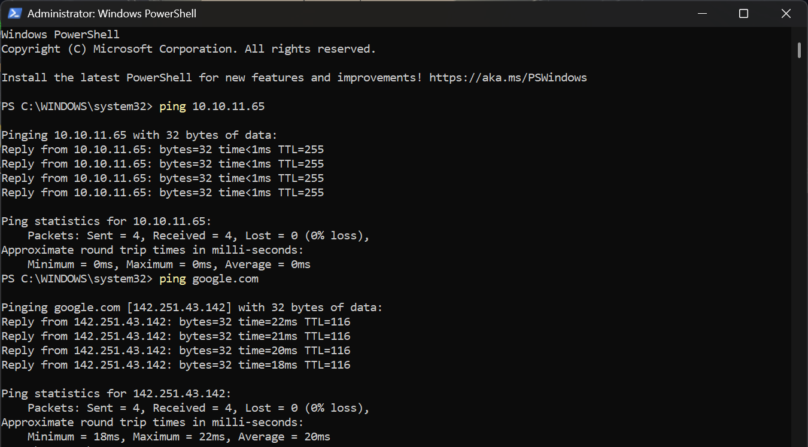

**SSH from the laptop:**

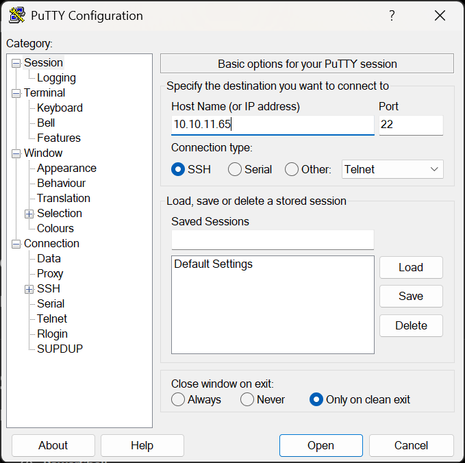
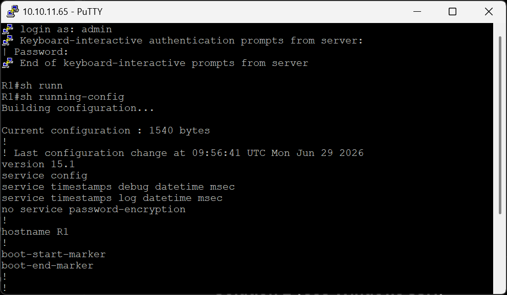

**Telnet from the laptop (baseline test, then left disabled):**

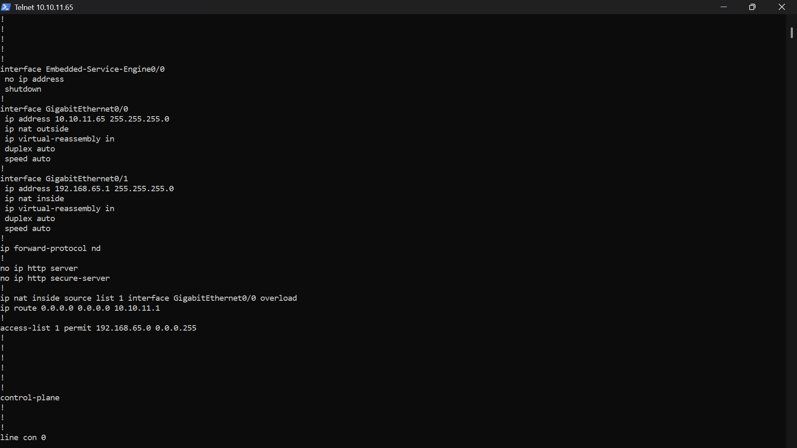
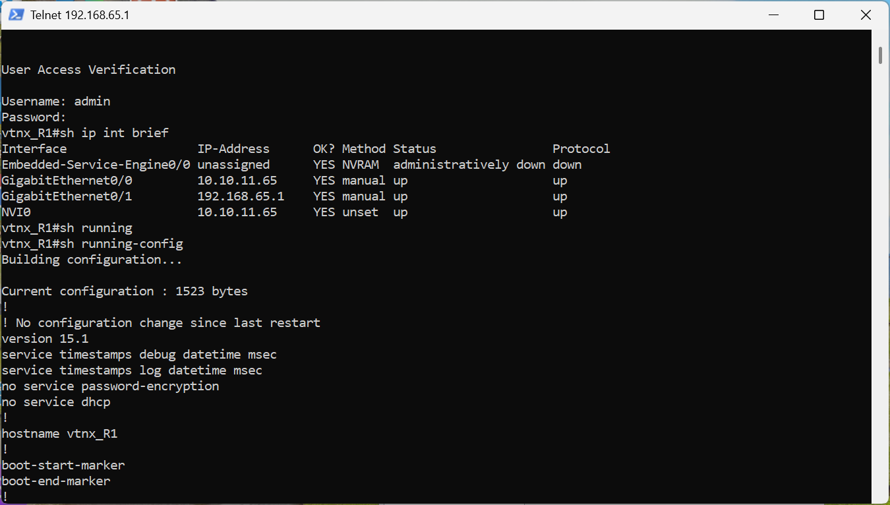
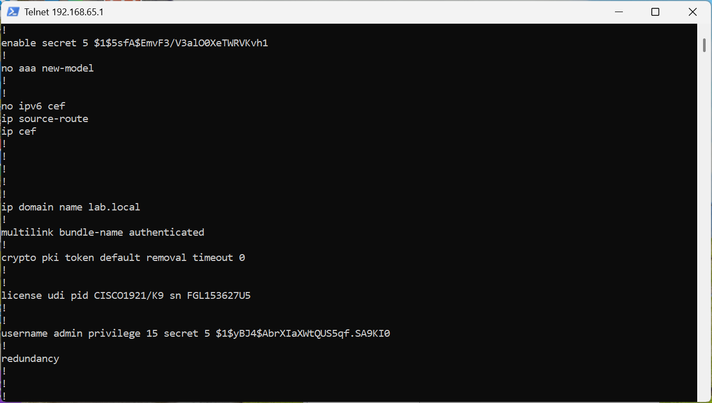
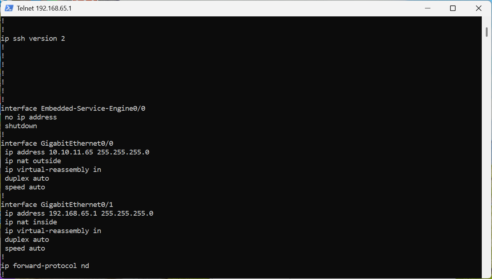

---

## Running Configuration — Final State

The full running config was captured via Telnet and SSH sessions. Key lines that prove
the configuration is complete:

```
hostname vtnx_R1

interface GigabitEthernet0/0
 ip address 10.10.11.65 255.255.255.0
 ip nat outside

interface GigabitEthernet0/1
 ip address 192.168.65.1 255.255.255.0
 ip nat inside

ip nat inside source list 1 interface GigabitEthernet0/0 overload
ip route 0.0.0.0 0.0.0.0 10.10.11.1

access-list 1 permit 192.168.65.0 0.0.0.255

ip domain name lab.local
ip ssh version 2

username admin privilege 15 secret 5 $1$yBJ4$...
```

---

## What Was Learned From This Volume

On a real router, the order of operations matters more than it does in simulation.
Configure NAT outside before inside. Bring interfaces up before configuring routing.
Verify each layer works before building the next one on top of it.

The `no ip domain-lookup` command becomes essential the first time you mistype a
command on real hardware and watch the router pause for 30 seconds trying to DNS
resolve `sh` as a hostname.

And `login local` without a username in the local database locks you out of SSH
completely. Always create the username before saving the configuration.

---

**Next:** [Vol 02 — Enterprise Switch: VLANs, DHCP, ACL Security](../Vol_02_Enterprise_Switch/)
