# Vol 02 — Enterprise Switch: VLANs, DHCP, ACL Security

**Hardware:** Cisco 1921 ISR (from Vol 01) + Cisco Catalyst 3560-CX
**Access:** Console cable → PuTTY (COM5 for switch, COM4 for router)
**Goal:** Add a Layer 3 switch, segment into four VLANs, assign DHCP per VLAN, then
enforce an isolation policy using extended ACLs — and document two real issues found
during the build

---

The router from Vol 01 already works. It has a WAN interface up, NAT configured, SSH
working. The plan here was simple on paper: attach a Cisco Catalyst 3560-CX to the
router's LAN side, move all the internal work onto the switch, and build out a proper
four-VLAN enterprise structure.

In practice, two things broke in non-obvious ways. Both are documented below, in
detail, because the way they broke is more useful to know about than the fact that
they eventually got fixed.

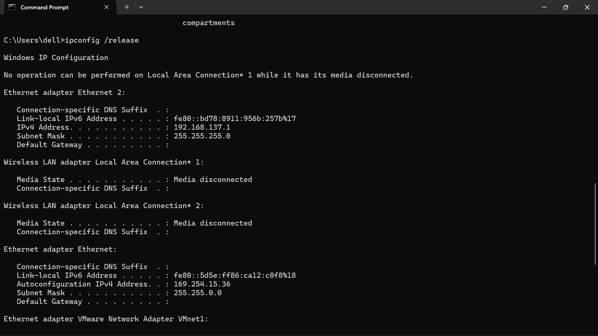
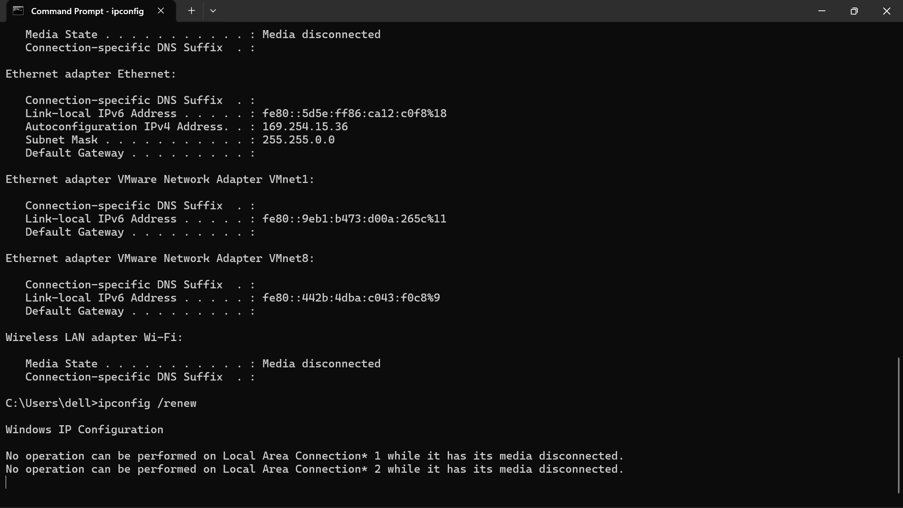

---

## The Final Topology

```
        Internet (real upstream)
                │
         10.10.11.1/24
                │
     G0/0 — 10.10.11.65/24
        ┌───────────────┐
        │  Cisco 1921   │  vtnx_R1
        └───────────────┘
     G0/1 — 192.168.65.1/24
                │
     Routed port — 192.168.65.2/24
        ┌──────────────────────┐
        │  Catalyst 3560-CX   │  vtnx_SW1
        └──────────────────────┘
      ┌──────┬──────┬──────┐
   VLAN10  VLAN20 VLAN30 VLAN40
   SALES    HR     IT    GUEST
```

The router only handles WAN and NAT now. Everything internal — VLANs, routing between
them, DHCP, and the ACL security policy — lives on the switch.

---

## IP Addressing

| VLAN | Name | Network | Gateway (SVI) |
|------|------|---------|---------------|
| 10 | SALES | 192.168.10.0/24 | 192.168.10.1 |
| 20 | HR | 192.168.20.0/24 | 192.168.20.1 |
| 30 | IT | 192.168.30.0/24 | 192.168.30.1 |
| 40 | GUEST | 192.168.40.0/24 | 192.168.40.1 |
| Router–Switch link | — | 192.168.65.0/24 | Router: .1 / Switch: .2 |

---

## Part 1 — Attaching the Switch

The first thing the 3560-CX needs is `ip routing`. Without it the switch forwards
frames at Layer 2 only — SVIs can have IP addresses but traffic between them goes
nowhere. This is the single most commonly forgotten command on a multilayer switch
and it produces a symptom that looks like routing is broken when the config appears
correct.

```
ip routing
```

The port connecting to the router is converted from a switchport into a routed Layer 3
interface — it behaves like a router interface, not a switch port.

```
interface g0/3
 no switchport
 ip address 192.168.65.2 255.255.255.0
 no shutdown
```

Then the VLANs and their SVIs:

```
vlan 10
 name SALES
vlan 20
 name HR
vlan 30
 name IT
vlan 40
 name GUEST

interface vlan10
 ip address 192.168.10.1 255.255.255.0
 no shutdown
interface vlan20
 ip address 192.168.20.1 255.255.255.0
 no shutdown
interface vlan30
 ip address 192.168.30.1 255.255.255.0
 no shutdown
interface vlan40
 ip address 192.168.40.1 255.255.255.0
 no shutdown
```

On the router side, static routes pointing back to the switch are essential. Without
them, traffic from a VLAN PC can reach the internet — the switch forwards it to the
router, the router NATSs it out — but return traffic arrives at the router and gets
dropped because the router has no route to 192.168.10.0/24 or any VLAN subnet. The
symptom is DHCP working, gateway reachable, but no internet. Pinging the upstream
router works from the PC. Pinging 8.8.8.8 fails.

```
ip route 192.168.10.0 255.255.255.0 192.168.65.2
ip route 192.168.20.0 255.255.255.0 192.168.65.2
ip route 192.168.30.0 255.255.255.0 192.168.65.2
ip route 192.168.40.0 255.255.255.0 192.168.65.2
```

Default route on the switch pointing to the router:

```
ip route 0.0.0.0 0.0.0.0 192.168.65.1
```

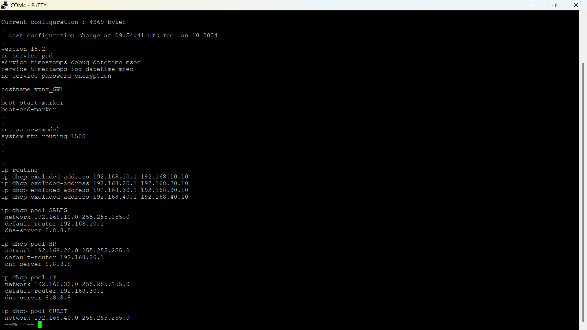
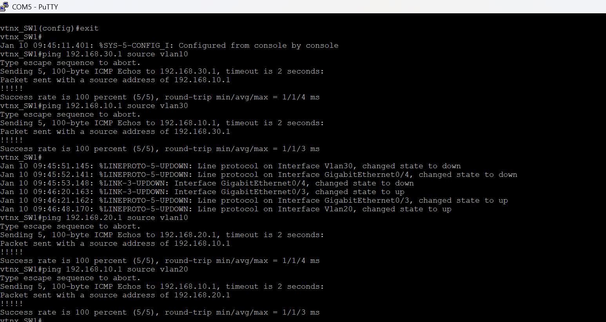

---

## Part 2 — DHCP

DHCP runs on the switch, not the router. Each VLAN gets its own pool. Addresses .1
through .20 are excluded across all VLANs — gateways, printers, and anything static
lives in that range and should never be handed out dynamically.

```
ip dhcp excluded-address 192.168.10.1 192.168.10.20
ip dhcp excluded-address 192.168.20.1 192.168.20.20
ip dhcp excluded-address 192.168.30.1 192.168.30.20
ip dhcp excluded-address 192.168.40.1 192.168.40.20

ip dhcp pool SALES
 network 192.168.10.0 255.255.255.0
 default-router 192.168.10.1
 dns-server 8.8.8.8

ip dhcp pool HR
 network 192.168.20.0 255.255.255.0
 default-router 192.168.20.1
 dns-server 8.8.8.8

ip dhcp pool IT
 network 192.168.30.0 255.255.255.0
 default-router 192.168.30.1
 dns-server 8.8.8.8

ip dhcp pool GUEST
 network 192.168.40.0 255.255.255.0
 default-router 192.168.40.1
 dns-server 8.8.8.8
```

At this point the NAT ACL on the router still only permits 192.168.65.0/24 — the
original single-LAN subnet from Vol 01. VLAN traffic arriving at the router for
internet-bound translation simply got dropped at the NAT process, silently. That's
the first real issue encountered, documented below.

```
access-list 1 permit 192.168.10.0 0.0.0.255
access-list 1 permit 192.168.20.0 0.0.0.255
access-list 1 permit 192.168.30.0 0.0.0.255
access-list 1 permit 192.168.40.0 0.0.0.255
```

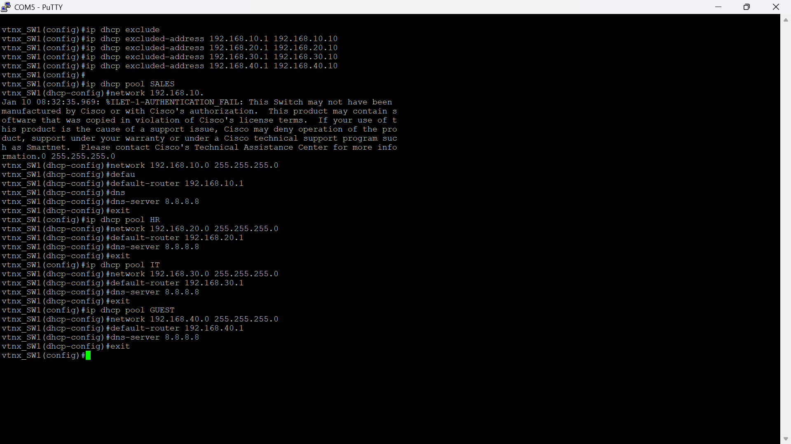
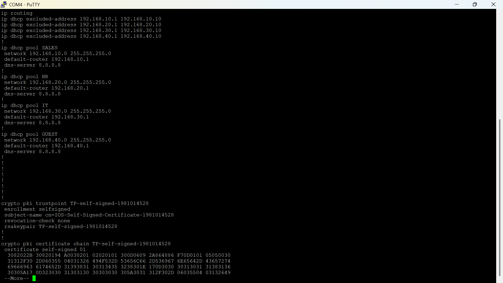
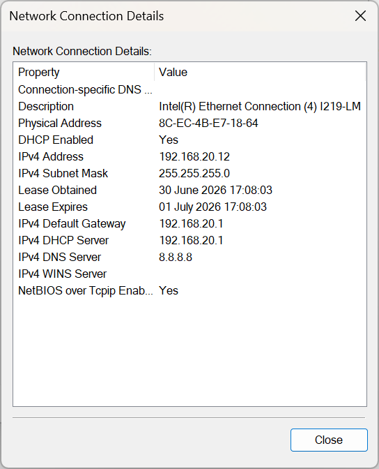
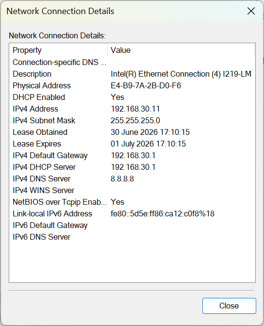
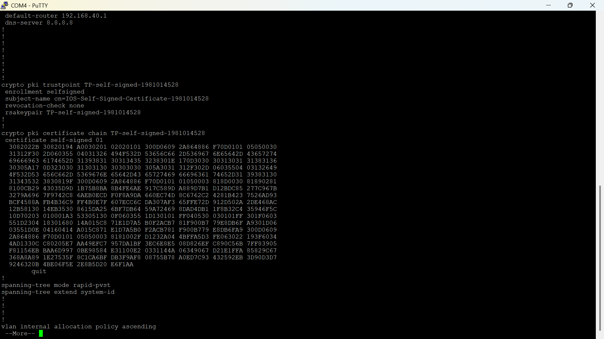
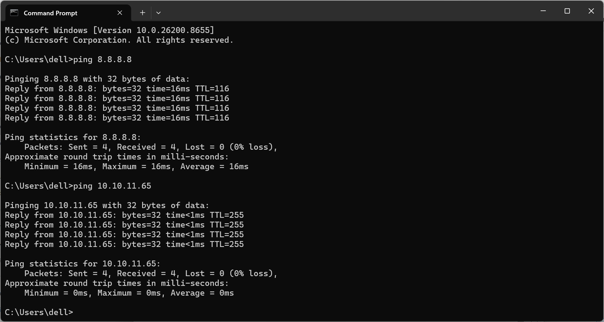
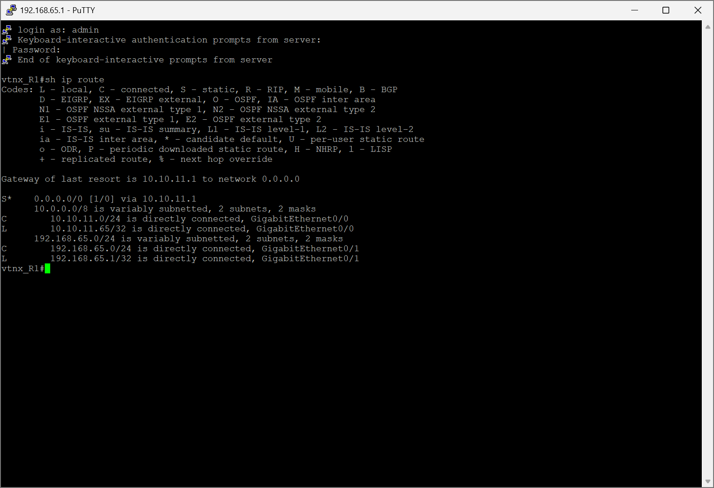

---

## Part 3 — Inter-VLAN ACL Security

Once every VLAN had a confirmed working lease and could independently reach the
internet, the ACL went in. This ordering was deliberate — any failure after applying
the ACL is caused by the ACL, not by something lurking underneath in DHCP or routing.

The policy:

| | SALES | HR | IT | GUEST | Internet |
|---|---|---|---|---|---|
| **SALES** | — | ✗ | ✅ | ✅ | ✅ |
| **HR** | ✗ | — | ✅ | ✅ | ✅ |
| **IT** | ✅ | ✅ | — | ✅ | ✅ |
| **GUEST** | ✗ | ✗ | ✗ | — | ✅ |

SALES and HR are mutually isolated. GUEST is isolated from all internal VLANs. IT
can reach everything. Everyone keeps internet access.

```
ip access-list extended VLAN_SECURITY
 deny ip 192.168.10.0 0.0.0.255 192.168.20.0 0.0.0.255
 deny ip 192.168.10.0 0.0.0.255 192.168.40.0 0.0.0.255
 deny ip 192.168.20.0 0.0.0.255 192.168.10.0 0.0.0.255
 deny ip 192.168.40.0 0.0.0.255 192.168.10.0 0.0.0.255
 deny ip 192.168.40.0 0.0.0.255 192.168.20.0 0.0.0.255
 deny ip 192.168.40.0 0.0.0.255 192.168.30.0 0.0.0.255
 permit ip any any
```

The `permit ip any any` at the end is not optional. Every ACL ends with an invisible
`deny ip any any`. Without an explicit permit at the bottom, applying this ACL to
an SVI would silently kill internet access for everyone in that VLAN — because
internet-bound traffic doesn't match any deny line, falls through to the implicit
deny, and gets dropped. It's the kind of thing that's obvious in hindsight and
not obvious at all the first time it happens at 2am.

Applied inbound on the SVIs of restricted VLANs only. IT (VLAN 30) gets no ACL
because the policy places no restriction on what IT can reach.

```
interface vlan10
 ip access-group VLAN_SECURITY in
interface vlan20
 ip access-group VLAN_SECURITY in
interface vlan40
 ip access-group VLAN_SECURITY in
```

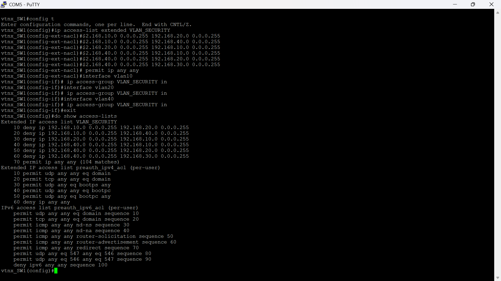
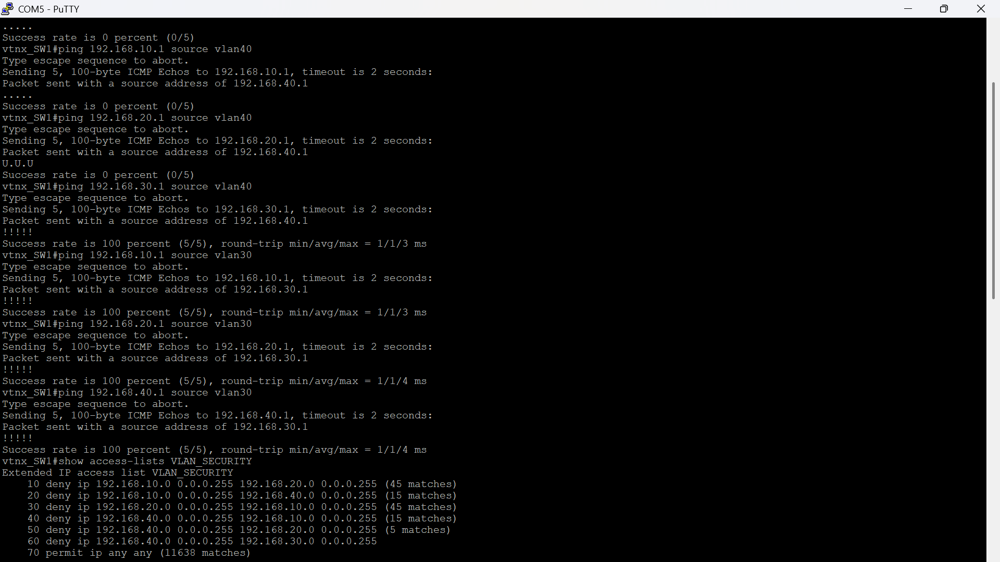
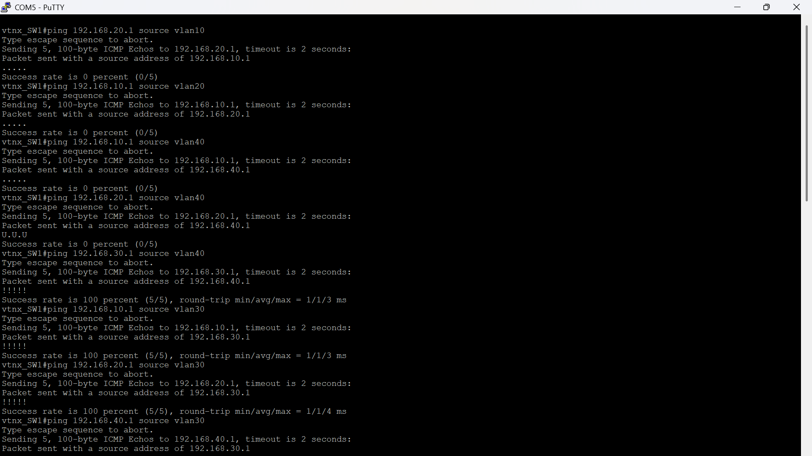

---

## Part 4 — Layer 2 Hardening

With the VLAN and ACL work done, the switch access ports got hardened against common
Layer 2 attacks. These features don't change how the network functions for legitimate
users — they protect it from unauthorized devices, rogue DHCP servers, ARP spoofing,
and broadcast storms.

### Port Security — Sticky MAC

```
interface range g0/1-2
 switchport port-security
 switchport port-security maximum 1
 switchport port-security mac-address sticky
 switchport port-security violation shutdown
```

The first device that connects gets its MAC learned and locked to that port. Plug in
a second device — or pull out the first and connect a different one — and the port
goes err-disabled. To recover: `shutdown` then `no shutdown`.

### DHCP Snooping

```
ip dhcp snooping
ip dhcp snooping vlan 10,20,30,40
interface g0/3
 ip dhcp snooping trust
```

Without snooping, any device on the network can start answering DHCP requests and
hand out addresses pointing to a rogue gateway. Snooping marks the uplink to the
router as trusted and drops DHCP server responses arriving from any other port.

### Dynamic ARP Inspection

```
ip arp inspection vlan 10,20,30,40
interface g0/3
 ip arp inspection trust
```

Relies on the DHCP snooping binding table to validate ARP replies. If a device sends
an ARP claiming an IP address that doesn't match its lease, DAI drops the packet. This
blocks ARP poisoning — the basis of most man-in-the-middle attacks on local networks.

### BPDU Guard

```
interface range g0/1-2
 spanning-tree portfast
 spanning-tree bpduguard enable
```

PortFast makes access ports skip the STP listening and learning states — useful for
end devices that don't need a 30-second wait before passing traffic. BPDU Guard is
the safety net: if a port with PortFast enabled ever receives a BPDU (which means a
switch got connected where a PC should be), the port goes err-disabled immediately
to protect the STP topology.

### Storm Control

```
interface range g0/1-2
 storm-control broadcast level 5.00
 storm-control multicast level 5.00
 storm-control action shutdown
```

Caps broadcast and multicast at 5% of link capacity. If anything — a misconfigured
device, a loop, a software fault — starts flooding the segment, the port shuts rather
than letting the storm saturate the switch.

---

## Two Real Issues Found During This Build

### Issue 1 — VLANs Configured, DHCP Pools Configured, But 169.254.x.x Everywhere

After configuring the VLANs and DHCP pools, every test device came up with a 169.254.x.x
address. The pools existed. The access ports were in the right VLANs. Nothing in the
DHCP configuration looked wrong.

The SVIs were missing.

The DHCP pool says `network 192.168.10.0 255.255.255.0` and `default-router 192.168.10.1`
— but if there is no `interface vlan10` with `ip address 192.168.10.1` on the switch, the
switch has no Layer 3 presence in that subnet. It can't answer DHCP discovers arriving
from that VLAN because as far as the switch's routing table is concerned, that network
doesn't exist on any interface.

The fix was creating the SVIs, and the fix worked immediately. But the lesson is that
a correctly configured DHCP pool tells you nothing about whether the SVI exists. They're
two separate things and both have to be present.

### Issue 2 — DHCP Working, IPs Assigned, Internet Completely Broken

After the SVIs were in and DHCP started handing out addresses correctly, internet access
still failed. Pinging the gateway worked. Pinging the router LAN interface worked. Pinging
8.8.8.8 failed. Pinging google.com failed.

The NAT ACL on the router still only permitted `192.168.65.0 0.0.0.255` — the original
LAN from Vol 01. When VLAN traffic arrived at the router from `192.168.10.x` or
`192.168.20.x` and hit the NAT process, the source IP didn't match any permit line.
NAT dropped the translation silently. No error, no log, no hint — the packet just
disappeared after reaching the router.

The diagnostic that found it was `show ip nat translations` on the router. No entries
for any 192.168.10.x source address. That confirmed the packets were arriving at the
router — because if they hadn't, they would have shown up in ping failures at a
different point — but weren't being translated.

Adding the VLAN subnets to access-list 1 fixed it immediately.

The broader takeaway: any time you add a new subnet behind a NAT router, the NAT ACL
needs updating. It doesn't update itself, nothing warns you when it's incomplete, and
the failure mode looks identical to half a dozen other possible problems.

---

## Verification Commands Used

```
! Switch
show ip interface brief         ! SVIs up/up — must check this before anything else
show vlan brief                 ! VLAN database and port membership
show ip route                   ! Default route to router + connected VLAN routes
show ip dhcp binding            ! Which IPs are currently leased to which MACs
show access-lists VLAN_SECURITY ! Match counters — the only reliable ACL test
show ip interface vlan10        ! Confirms VLAN_SECURITY is actually bound inbound
show port-security              ! Sticky MAC status per port
show ip dhcp snooping           ! Trusted interfaces and binding table
show ip arp inspection          ! Drop counter — should be zero for legitimate traffic
show spanning-tree summary      ! PortFast and BPDU Guard active status

! Router
show ip interface brief         ! Both interfaces still up after switch addition
show ip route                   ! Static routes to VLAN subnets present
show ip nat translations        ! VLAN source IPs appearing here = NAT is working
show ip nat statistics          ! Hits on the NAT ACL — number of translated flows
```

---

**For a detailed breakdown of the third issue encountered — the ACL appearing to fail
for one VLAN pair when it was actually working correctly — see:**
**[ACL Troubleshooting — Switch-Sourced Ping Problem](ACL_Troubleshooting.md)**

---

**Previous:** [Vol 01 — Router Baseline](../Vol_01_Router_Baseline/)
