# Endian Firewall on Real Hardware: A Beginner's Walkthrough

Most Endian Firewall tutorials online are done inside VirtualBox — spin up a VM, add a virtual NIC, done. I wanted to see what the experience looks like when there's no "undo" button: real hardware, real cables, and a laptop as the actual test client instead of a second virtual machine sitting next to it on the same host.

This is a walkthrough of setting up Endian Firewall Community Edition on a repurposed PC, configuring it as a gateway between a lab router and a client laptop, and then actually putting it to work — blocking traffic, filtering websites, and watching the logs light up in real time.

Covers: firewall installation and CLI recovery, RED/GREEN network segmentation, outbound firewall rules and rule ordering, HTTP proxy and web filtering, live and historical logging.

## Meet the Hardware

The firewall box itself is a repurposed desktop PC:

- **CPU:** Intel i3
- **RAM:** 8 GB
- **NICs:** 3 total — one built into the motherboard (Realtek), two additional Intel NICs added via expansion slots

Three NICs is exactly what you want for a RED/GREEN two-zone setup with a spare: one interface faces the lab router (RED / uplink), one faces the internal network (GREEN), and the onboard Realtek ended up sitting unused for this lab.

The laptop plugs directly into the GREEN interface — no switch in between, since this is a single-client lab setup. The RED interface goes straight into a LAN port on the lab router, which hands out a DHCP address on the uplink side.

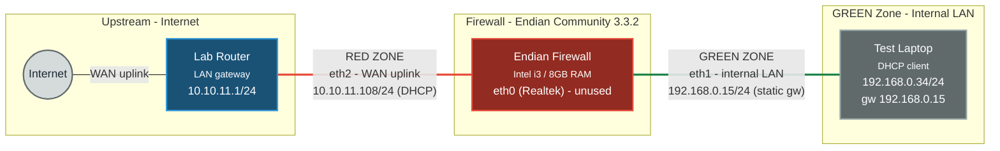
```mermaid
flowchart LR
    subgraph WAN["Upstream - Internet"]
        internet(("Internet")):::cloud
        router["Lab Router<br/><small>LAN gateway</small><br/>10.10.11.1/24"]:::router
    end
    subgraph FWZONE["Firewall - Endian Community 3.3.2"]
        fw["Endian Firewall<br/><small>Intel i3 / 8GB RAM</small><br/>eth0 (Realtek) - unused"]:::firewall
    end
    subgraph GREEN["GREEN Zone - Internal LAN"]
        laptop["Test Laptop<br/><small>DHCP client</small><br/>192.168.0.34/24<br/>gw 192.168.0.15"]:::host
    end
    internet ---|"WAN uplink"| router
    router ===|"RED ZONE<br/>eth2 - WAN uplink<br/>10.10.11.108/24 (DHCP)"| fw
    fw ===|"GREEN ZONE<br/>eth1 - internal LAN<br/>192.168.0.15/24 (static gw)"| laptop
    classDef cloud fill:#d5dbdb,stroke:#616a6b,stroke-width:2px,color:#1c2833;
    classDef router fill:#1a5276,stroke:#3498db,stroke-width:2px,color:#ffffff;
    classDef firewall fill:#922b21,stroke:#e74c3c,stroke-width:2px,color:#ffffff;
    classDef host fill:#616a6b,stroke:#95a5a6,stroke-width:2px,color:#ffffff;
    linkStyle 1 stroke:#e74c3c,stroke-width:3px;
    linkStyle 2 stroke:#1e8449,stroke-width:3px;
```

| Device | Interface | IP Address | Role / Purpose |
|---|---|---|---|
| Lab Router | LAN | `10.10.11.1/24` | Upstream gateway, hands out DHCP on the RED side |
| Endian Firewall | RED (`eth2`) | `10.10.11.108/24` | WAN uplink, DHCP-assigned by the router |
| Endian Firewall | GREEN (`eth1`) | `192.168.0.15/24` | Internal LAN, statically assigned, default gateway for clients |
| Endian Firewall | `eth0` (Realtek) | — | Onboard NIC, left unused for this lab |
| Test Laptop | Ethernet | `192.168.0.34/24` | DHCP client, gateway `192.168.0.15` |

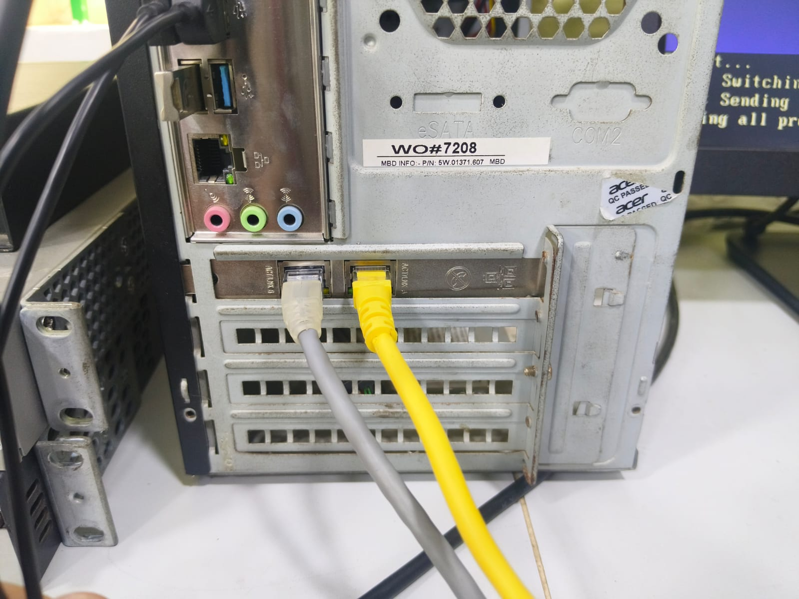

## Installing Endian Firewall

The installer itself is a straightforward text-mode wizard, run straight off boot media on the box:

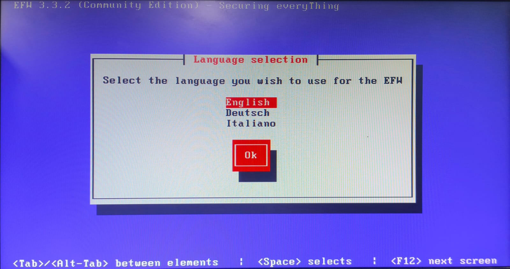

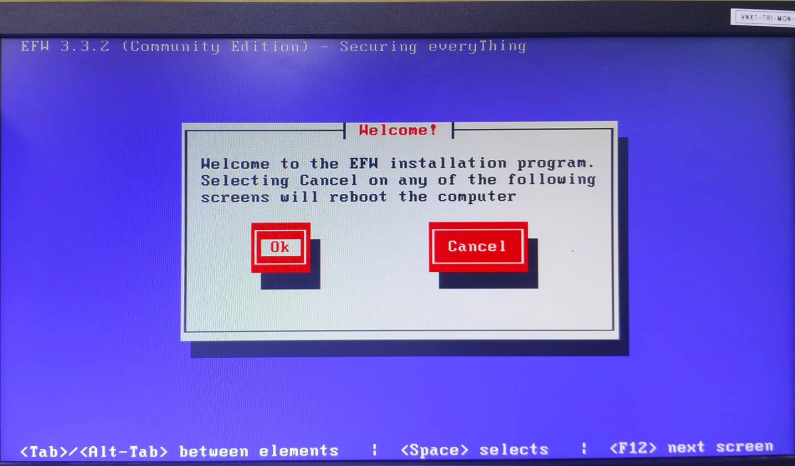

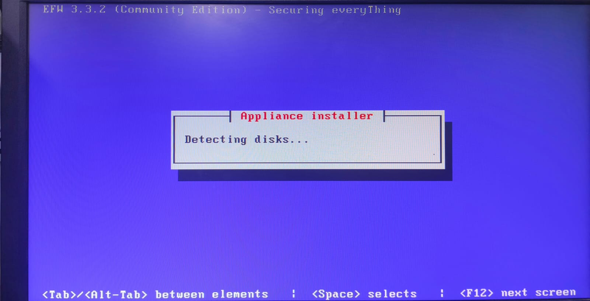

It gets a stern warning that **all data on the disk will be wiped** before it touches anything:

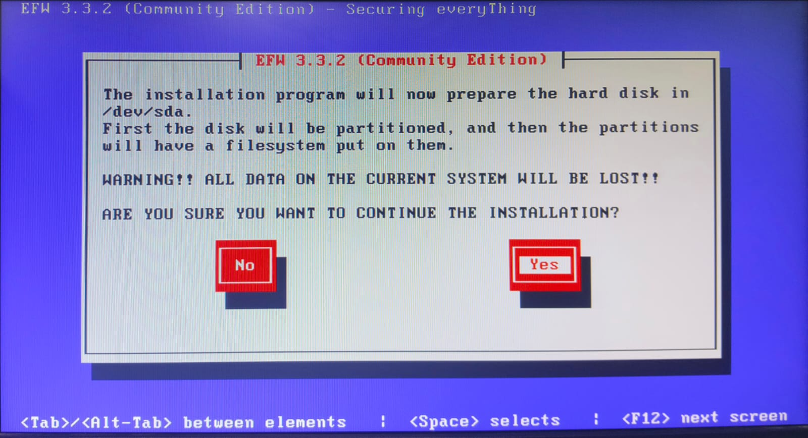

Confirm, and it partitions the drive and lays down the filesystem:

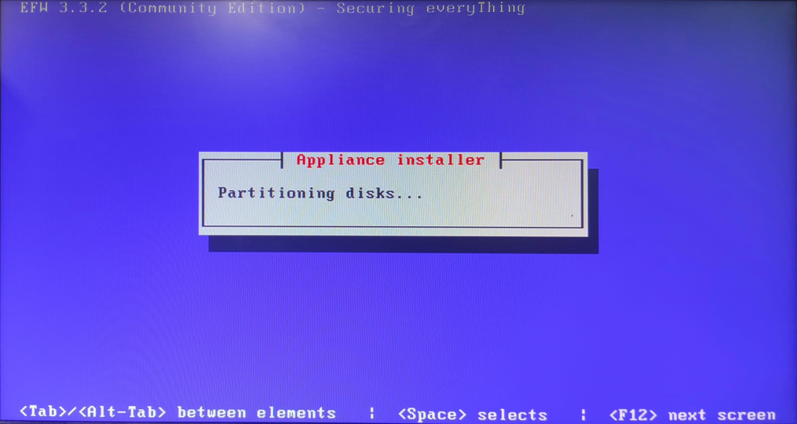

Partway through, it asks for the GREEN interface addressing directly:

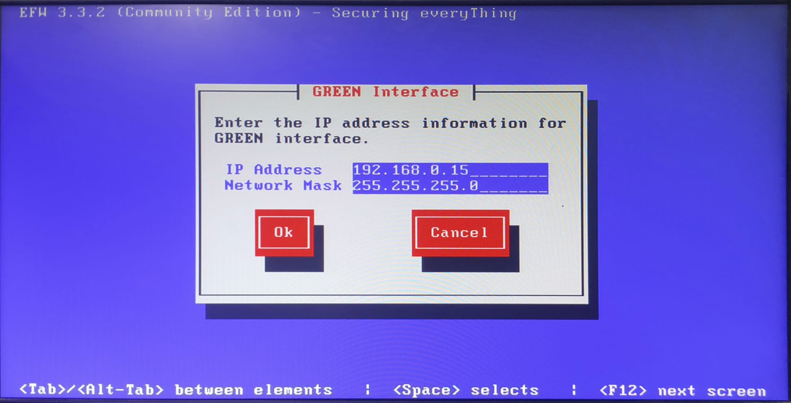

Then it runs post-installation procedures, and asks whether to enable a serial console (skipped here — no null-modem cable in this setup):

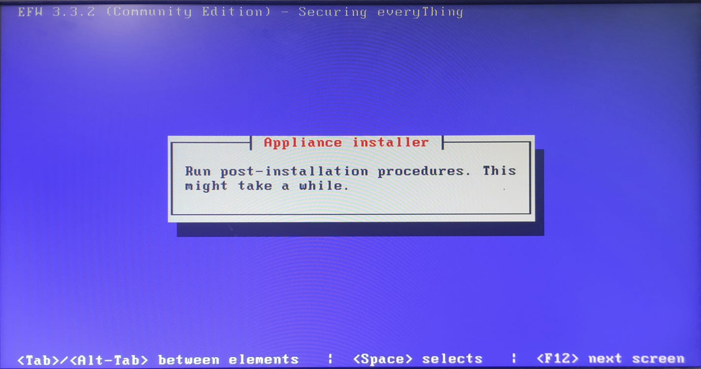

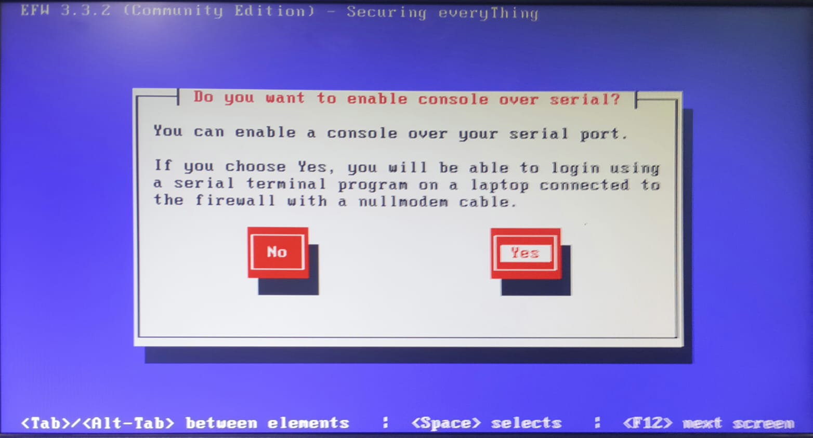

A few minutes later:

> "EFW was successfully installed. Please remove any media used for the installation from this computer. Now you should point your web browser at http://192.168.0.15 or https://192.168.0.15:10443 to complete its configuration."

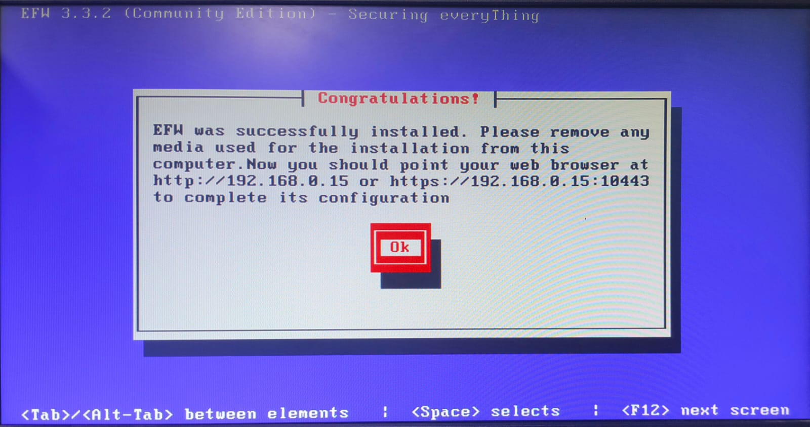

That's the moment where, in theory, you close the physical machine up, walk over to a client PC, open a browser, and finish setup through the GUI. In practice, it took a bit more than that.

## The Locked Door: When the GUI Won't Load

This is the part that doesn't show up in most beginner guides, and it's worth documenting because it's a genuinely common real-hardware snag: **the GUI wasn't reachable.**

The client laptop and the Endian box need to agree on addressing before HTTPS to the GUI will work at all. A couple of things can cause this — the client sitting on a static IP outside the firewall's subnet, or DHCP not yet being enabled on the GREEN zone. Until that's sorted, pointing a browser at the firewall's IP just times out.

The fix was to drop into the **console/CLI menu** directly on the machine (monitor and keyboard plugged into the box itself). Right after first boot, the console shows the box sitting with no GREEN zone configured yet — this is the state that was leaving the GUI unreachable:

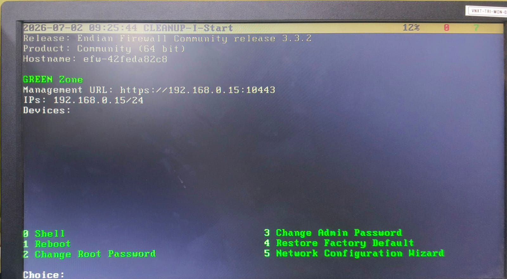

Endian's local console gives you a simple numbered menu:

```
0 Shell
1 Reboot
2 Change Root Password
3 Change Admin Password
4 Restore Factory Default
5 Network Configuration Wizard

Choice: _
```

Option **5** re-runs the network setup as a text-based wizard right there on the console — no browser needed. It asks for the root password first (the Endian default is `endian` out of the box, before you've changed it), and then walks through the same fields the GUI wizard would:

```
RED interface type <STATIC/DHCP/NOUPLINK/BRIDGED/MODEM>? DHCP
RED device <eth0/eth1/eth2>? eth2
GREEN devices <eth1/eth2>? eth1
GREEN IPs (IP/CIDR)? 192.168.0.15/24
Enable DHCP server on GREEN <on/off>? off
Allow access to ports 22, 80 and 10443 from any interface <on/off>? on
```

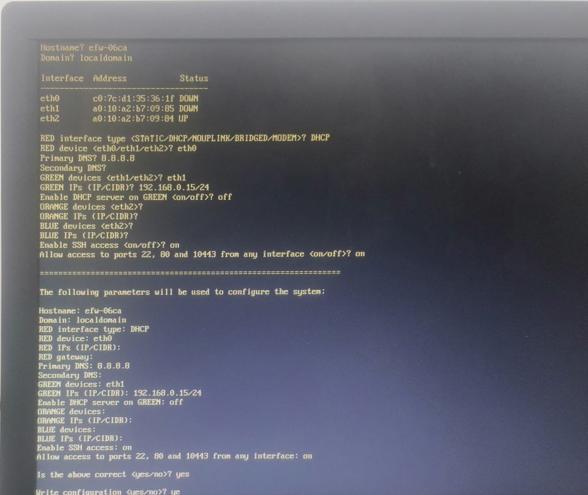

Confirm, and the box reboots into its final state, printing a clean summary on the console:

```
GREEN Zone
Management URL: https://192.168.0.15:10443
IPs: 192.168.0.15/24
Devices: eth1 [UP]

Uplink - main [ACTIVE]
IPs: 10.10.11.108/24 [DHCP]
Device: eth2 [UP]
```

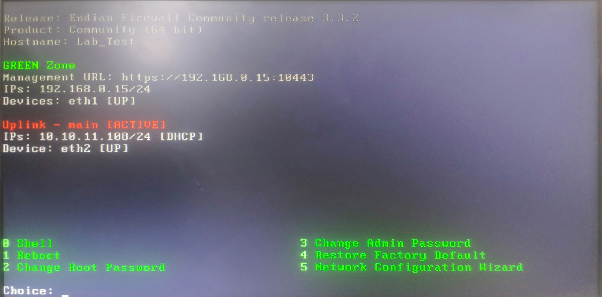

With addressing straightened out on both ends, `https://192.168.0.15:10443` finally loaded. Lesson learned: if the Endian GUI seems unreachable right after install, don't assume the box is broken — check IP addressing first, and the local console wizard (option 5) is the fastest way to reset networking without reinstalling from scratch.

## The 8-Step Network Wizard (GUI)

Once the GUI loads, first-login takes you through an 8-step network setup wizard — this time point-and-click instead of text prompts:

1. **Network mode and uplink type** — Routed mode, Ethernet DHCP for the RED (uplink) zone

   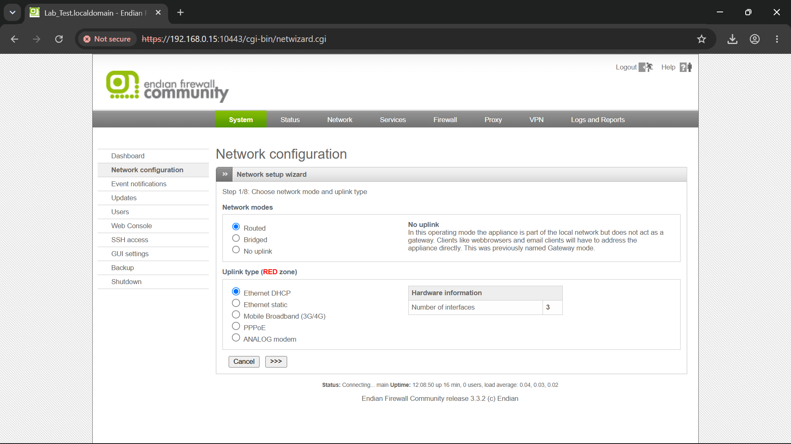

2. **Network zones** — decided against enabling ORANGE (DMZ) or BLUE (Wi-Fi) for this lab; kept it to GREEN + RED only

   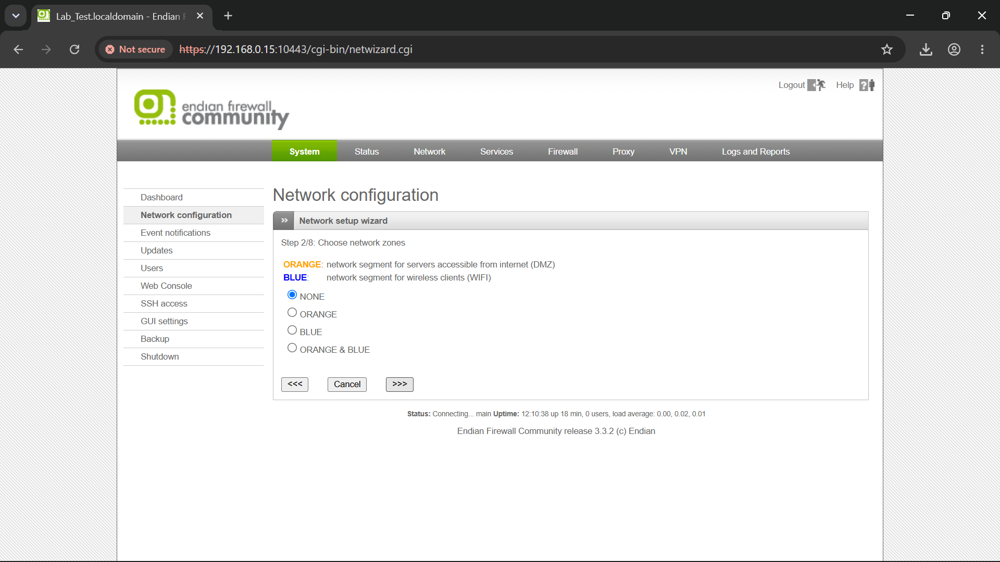

3. **GREEN interface preferences** — assigned `192.168.0.15/24` to eth1, DHCP server left off since the client was configured manually for this run

   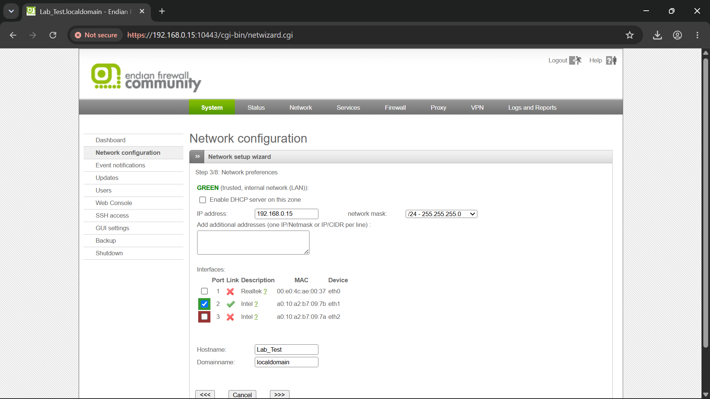

4. **RED / internet access preferences** — confirmed eth2 as the uplink interface, DNS set to automatic

   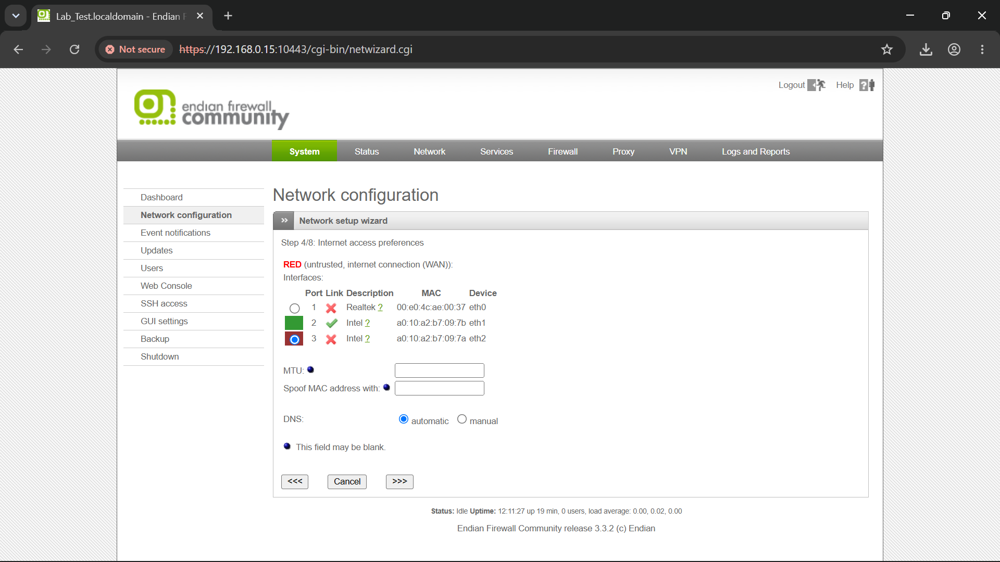

5. **DNS resolver configuration** — left on automatic, pulling DNS from the upstream DHCP lease

   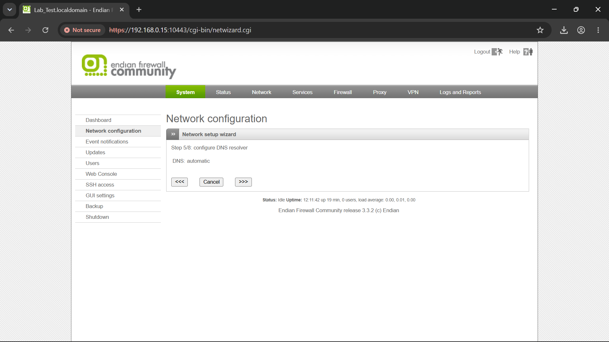

The remaining steps continue through hostname/domain confirmation and admin credentials before dropping you onto the dashboard for the first time — hostname `Lab_Test`, domain `localdomain`.

## First Look at the Dashboard

Once through the wizard, the dashboard gives a clean summary: appliance version (Community 3.3.2), uptime, CPU/memory/disk usage, live traffic graphs per interface, and uplink status. At this point `eth1` (GREEN), `eth2` (RED, uplink), and the bridge `br0` all show **Up**, with the uplink pulling `10.10.11.108/24` via DHCP from the lab router — confirmation that the earlier console fix actually held.

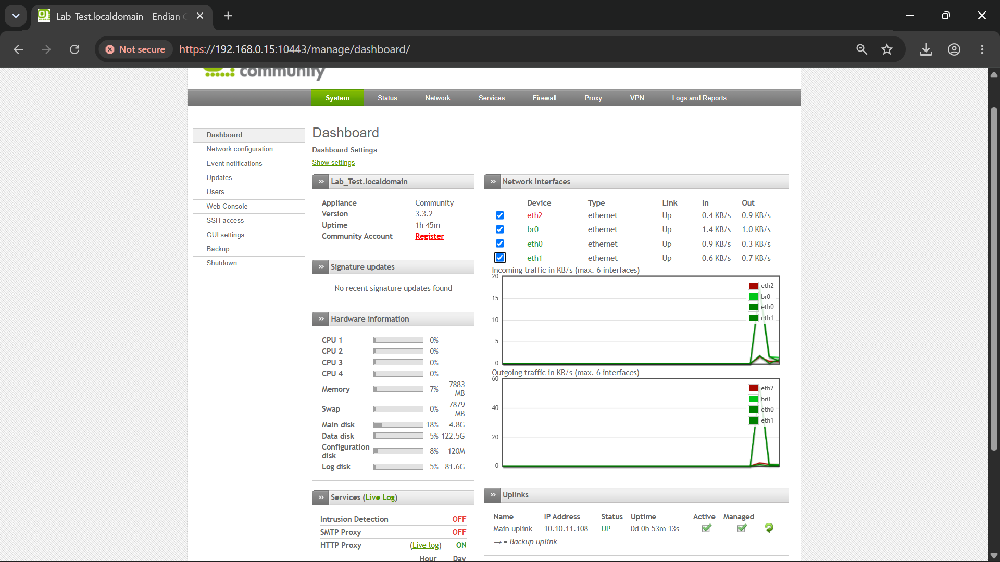

## Locking Down Outbound Traffic: Blocking ICMP

With the box reachable and routing traffic, the next step was proving the firewall actually *does* something — starting with something visible and easy to test: blocking outbound ping.

Endian ships with a set of default outgoing rules already in place (HTTP, HTTPS, FTP, SMTP, POP, IMAP, DNS, and even a default "allow PING" rule from GREEN/ORANGE/BLUE to RED). To block ICMP instead, a new rule was added *above* that default allow rule:

- **Source:** GREEN
- **Destination:** RED
- **Service:** User defined, protocol ICMP
- **Policy:** REJECT
- **Position:** First

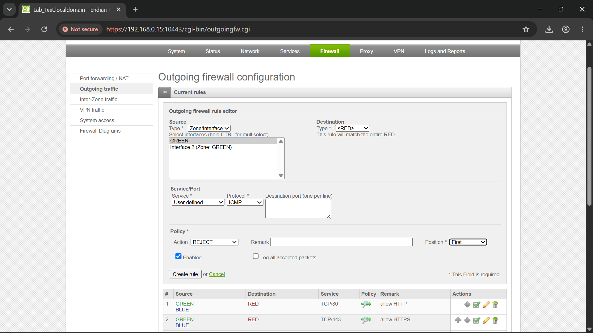

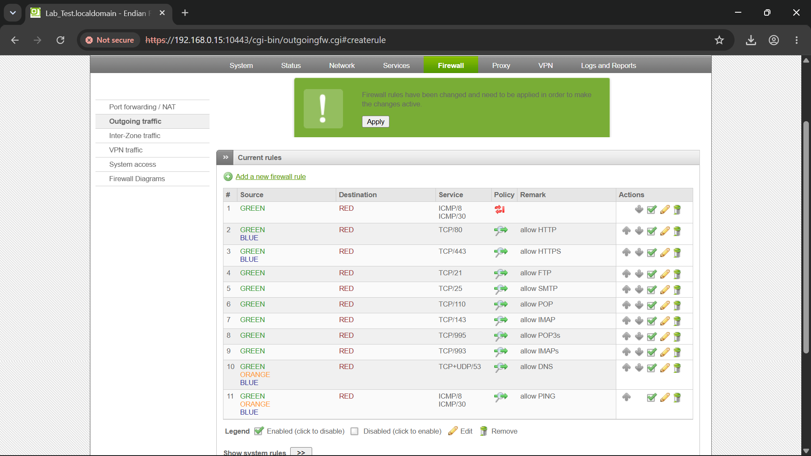

The before/after from the client laptop's command prompt tells the whole story:

```
C:\Users\dell 7480>ping 8.8.8.8

Pinging 8.8.8.8 with 32 bytes of data:
Reply from 8.8.8.8: bytes=32 time=18ms TTL=116
Reply from 8.8.8.8: bytes=32 time=16ms TTL=116
...
Ping statistics for 8.8.8.8:
    Packets: Sent = 4, Received = 4, Lost = 0 (0% loss)
```

That's before the rule was applied and pushed live. After applying it:

```
C:\Users\dell 7480>ping 8.8.8.8

Pinging 8.8.8.8 with 32 bytes of data:
Reply from 192.168.0.15: Destination port unreachable.
Reply from 192.168.0.15: Destination port unreachable.
Reply from 192.168.0.15: Destination port unreachable.
Reply from 192.168.0.15: Destination port unreachable.
```

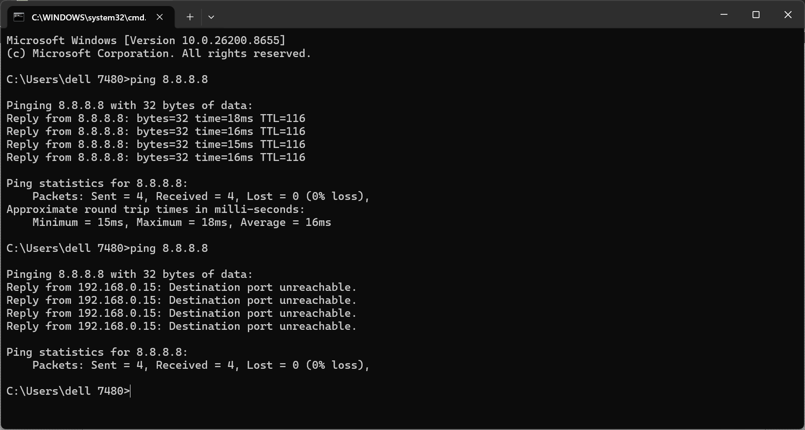

Notice the replies now come from the firewall itself (`192.168.0.15`), not from Google's DNS server — that's the REJECT policy actively answering on the firewall's behalf instead of silently dropping the packet. Rule ordering matters here: because the new REJECT rule sits in the **First** position, it's evaluated before the pre-existing "allow PING" rule further down the list, so it wins.

## Watching It Work: Live Logs

Endian's **Logs and Reports → Live Logs** view is genuinely useful for a lab like this — it's a real-time, color-coded stream you can filter by subsystem (Firewall, OpenVPN, HTTP Proxy, System, ClamAV, and more). Watching it during testing showed exactly what you'd expect: a stream of `INPUT:DROP` entries for background broadcast noise (NetBIOS on ports 137/138, DHCP renewal chatter on port 68), plus the firewall clearly logging the dropped/rejected ICMP traffic during the ping test above.

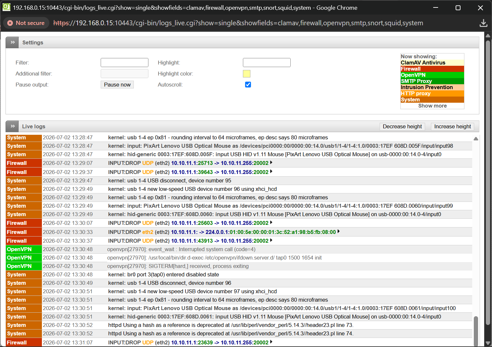

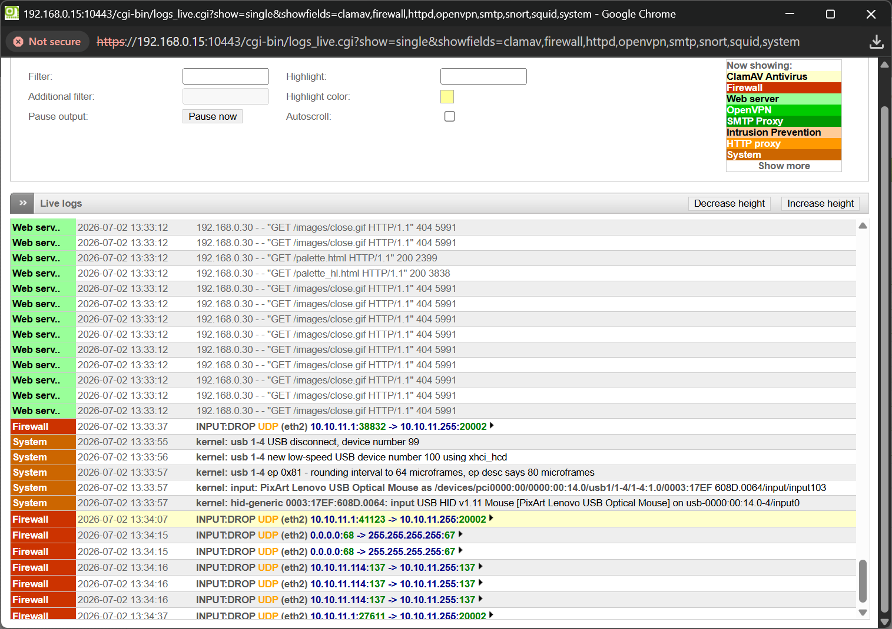

The dedicated **Firewall logs** view breaks this down further into a proper table — timestamp, chain, interface, protocol, source/destination IP and port, even MAC addresses — which made it easy to trace exactly which rule was catching which packet.

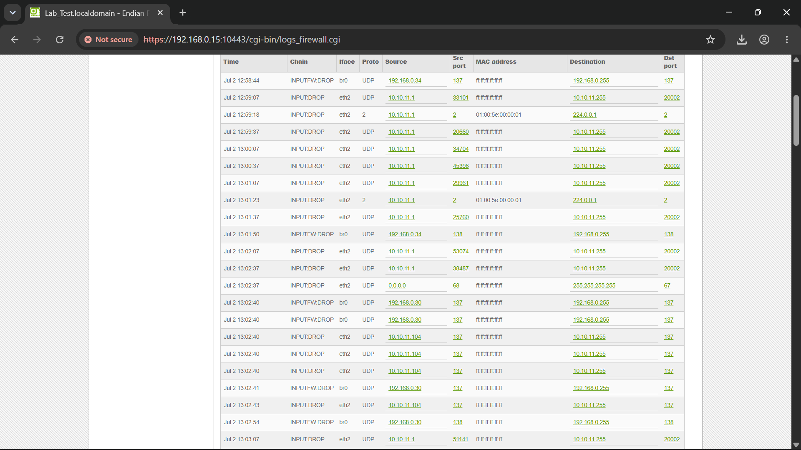

## Web Filtering and the HTTP Proxy

The last piece was content filtering, which in Endian lives under **Proxy → HTTP**:

1. **Enable HTTP Proxy** on the GREEN zone, running in *non-transparent* mode on port 8080 (non-transparent means clients need the proxy address configured manually — which is exactly what happened on the client laptop's browser settings, pointing it at `192.168.0.15:8080`)

   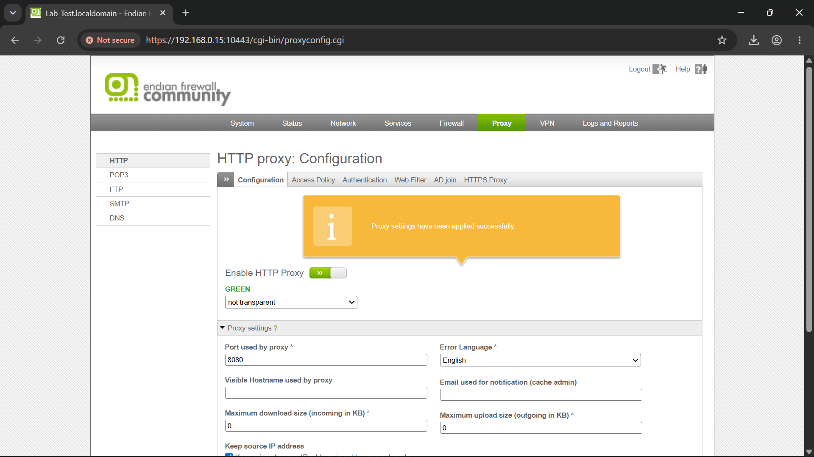

2. **Web Filter profile** — created a profile named `BlockTest` with antivirus scanning enabled, then added a custom blacklist blocking `www.youtube.com` and `www.instagram.com` under *Custom black- and whitelists*

   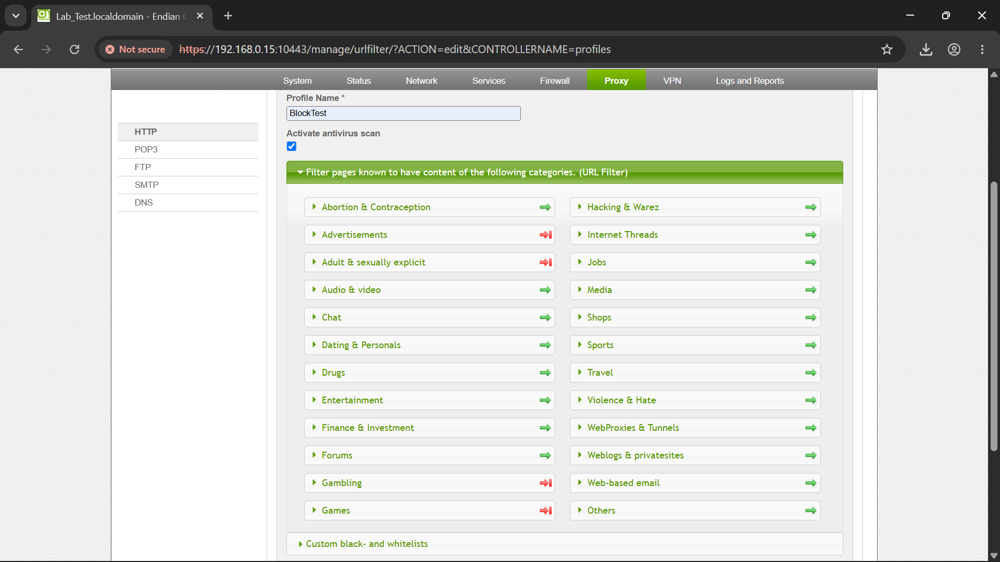

   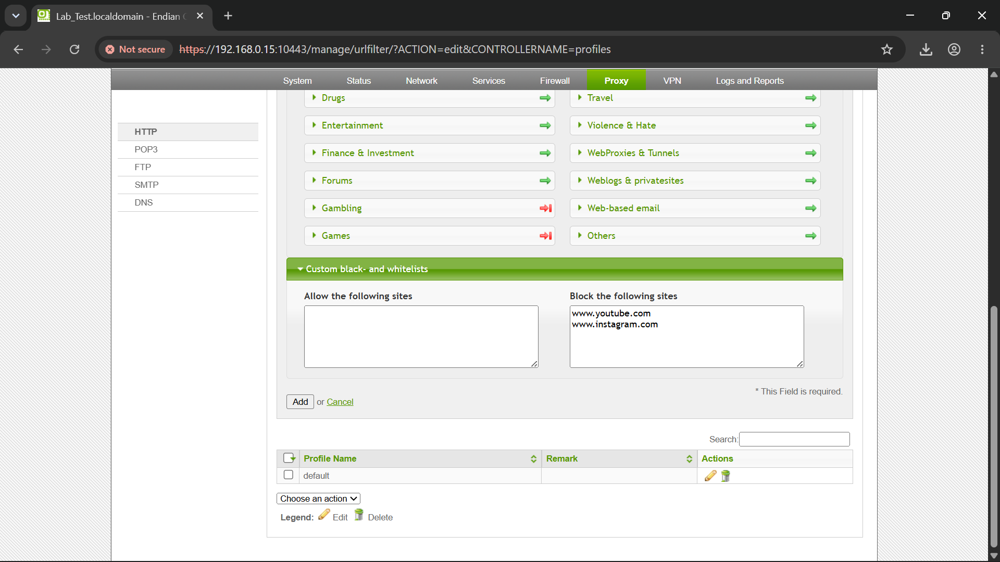

3. **Access Policy** — rather than applying the filter globally, the policy was scoped to a single source IP (`192.168.0.34`, the test laptop), with the `BlockTest` filter profile attached and the policy set to first position

   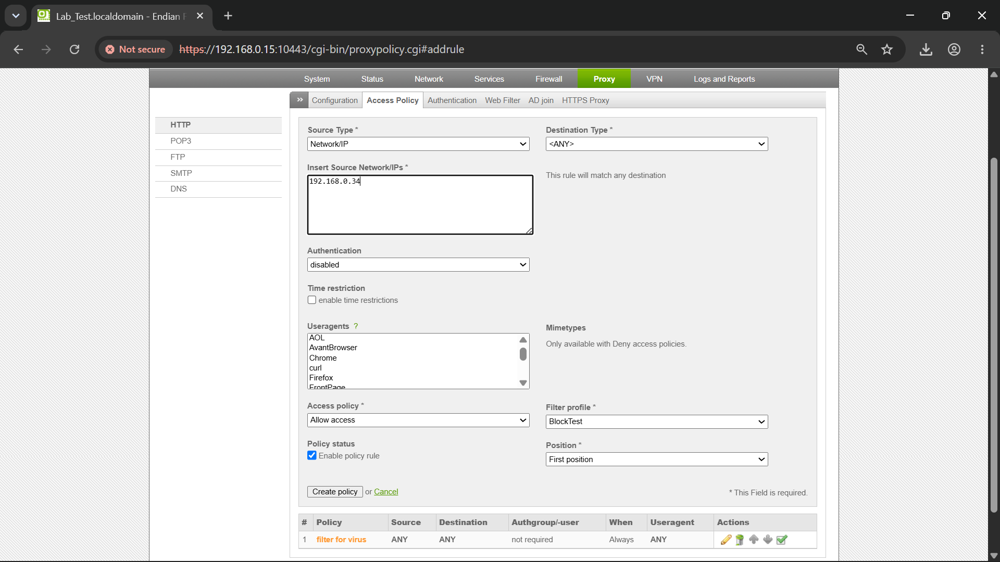

   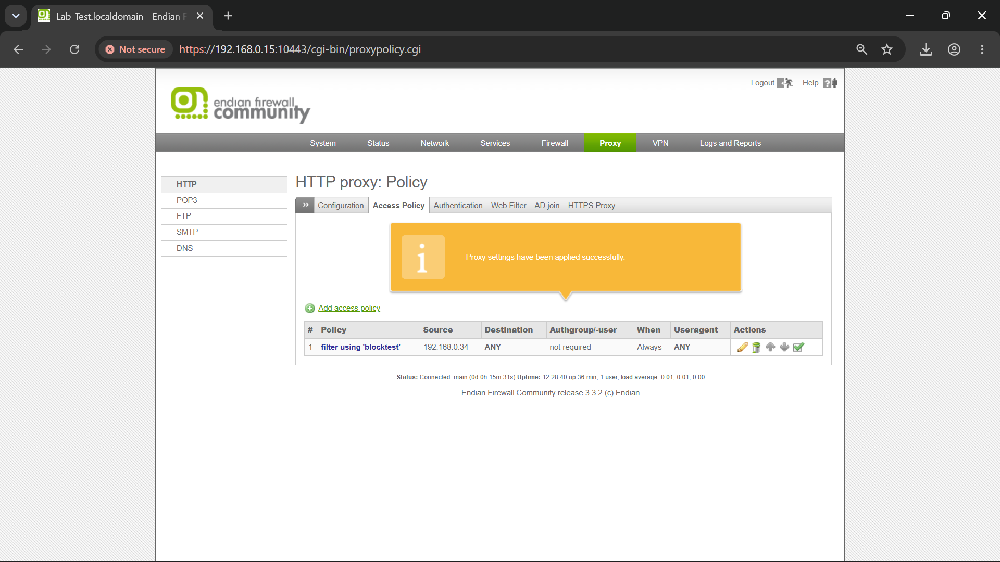

That last step is worth calling out for anyone new to Endian: the **Access Policy** tab is what actually ties a filter profile to *who* it applies to. Creating a filter profile alone does nothing until a policy references it — a distinction that's easy to miss on a first pass through the proxy settings.

## Troubleshooting Notes

A few things worth remembering, both from this run and general Endian gotchas worth knowing before you try this yourself:

- **GUI unreachable right after install?** Check IP addressing first (static vs DHCP mismatch between client and GREEN zone) before assuming the install failed.
- **Locked out of the GUI entirely?** The local console menu (options 0–5, accessed via keyboard/monitor on the box) can reset networking or reboot without touching the installed system. The default root password on a fresh install is `endian` — change it immediately after first login.
- **Filter profile created but nothing's actually being blocked?** Check the Access Policy tab — a web filter profile isn't active until it's referenced by a policy that matches the traffic you expect.
- **Non-transparent proxy configured but client traffic isn't going through it?** The client's browser/OS proxy settings need to point at the firewall's IP and port (`8080` by default) — non-transparent mode won't intercept traffic automatically the way transparent mode does.
- **Rule doesn't seem to be taking effect?** Check rule *position*, not just whether it's enabled — Endian evaluates outgoing firewall rules top-to-bottom, and an earlier matching rule wins even if a more specific one exists further down.

## What This Demonstrates

Working through this on physical hardware rather than nested VMs surfaced a class of problem that VirtualBox walkthroughs tend to skip past — the initial addressing mismatch that locks you out of the GUI is exactly the kind of thing that happens on real gear with a real client device, and knowing the console-based recovery path (rather than reaching for a reinstall) is a genuinely practical skill. Beyond that, the lab covers the core UTM feature set hands-on: zone-based interface roles, outbound firewall rule ordering, real-time log analysis, and proxy-based content filtering scoped to a specific client.

## What I Learned

- The practical difference between **REJECT** and **DROP** — REJECT answers back (which is why the client saw "destination port unreachable" instead of a silent timeout), while DROP would have just left the client hanging with no response at all.
- Why **firewall rule order** matters as much as the rule itself — a correctly configured REJECT rule does nothing if a broader ALLOW rule above it already matches the traffic first.
- How to **recover from a GUI lockout using the local console**, instead of assuming a fresh install is broken and starting over.
- How **non-transparent HTTP proxy** setups differ from transparent ones in what they actually require from the client side.
- What it takes to get real hardware talking to a real client, compared to the more forgiving environment of nested VMs on a single host.

## Interview Questions

A few questions this lab prepared me to answer:

**Q: Why REJECT instead of DROP for the ICMP rule?**
REJECT sends an explicit response back to the sender, which is easier to diagnose during testing since the client can see the packet was actively refused rather than silently vanishing. DROP is generally preferred in production perimeter rules since it gives an attacker less information, but for a lab where the point was to visibly demonstrate the block, REJECT made the behavior obvious.

**Q: Why separate the network into GREEN and RED zones instead of one flat network?**
Zone separation is the core idea behind a UTM firewall — RED (untrusted, facing the router/internet) and GREEN (trusted, internal) are treated with different default policies. It's what makes rules like "allow GREEN to reach RED on HTTPS" meaningful in the first place.

**Q: Why leave DHCP disabled on GREEN?**
For a single-client lab, static addressing on the client made it easier to predict and reference the exact IP in firewall and proxy rules, rather than needing to check a lease table every time the laptop reconnected.

**Q: Why non-transparent proxy instead of transparent?**
Non-transparent mode requires explicit proxy configuration on the client, which made it clear and controllable during testing which traffic was actually going through the proxy versus bypassing it — useful for confirming the web filter was doing something rather than assuming it.

**Q: Why does rule order matter in a firewall rule set?**
Most firewalls, Endian included, evaluate rules top-to-bottom and stop at the first match. A more specific or restrictive rule placed after a broader permissive one will never be reached — which is exactly why the ICMP REJECT rule had to be placed in the first position to take effect ahead of the default allow-ping rule.

## Project Structure

```
Endian_Firewall_Lab/
├── README.md
└── images/        # installer, console recovery, GUI wizard, firewall, proxy, and log screenshots
```

A `configs/` folder with exported firewall/proxy rule backups (rather than just screenshots) would be a natural next addition to this lab.
