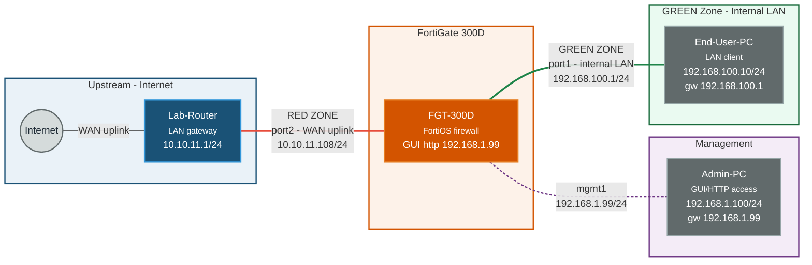
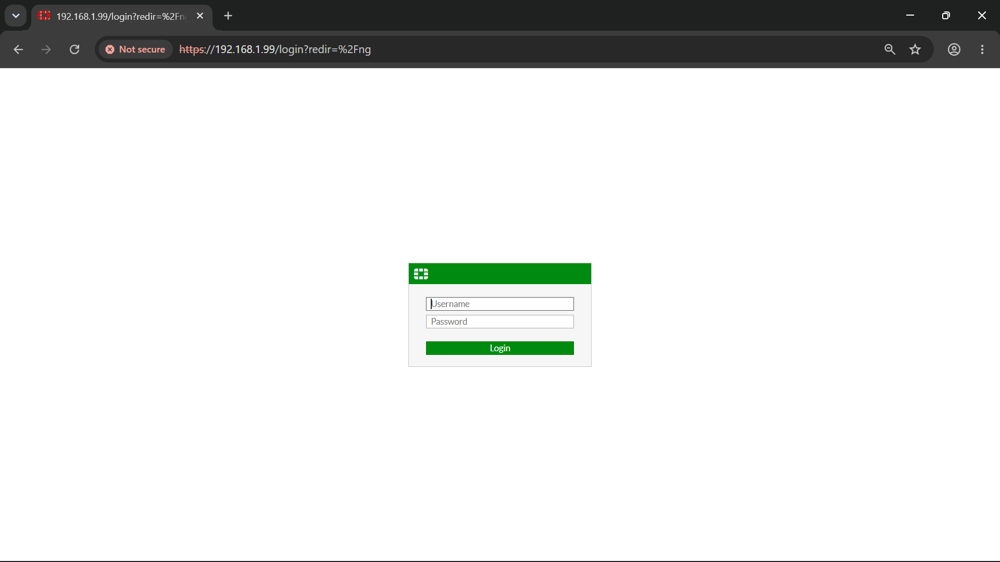
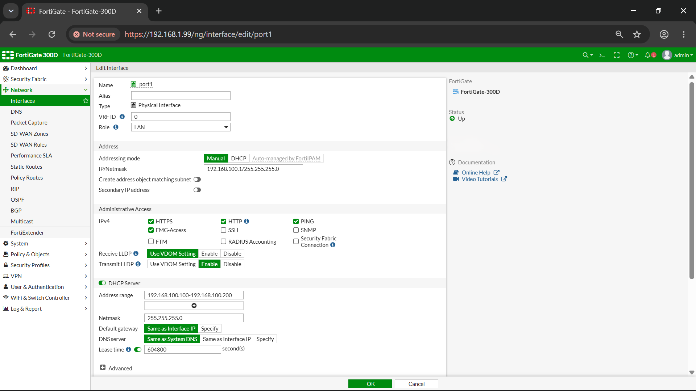
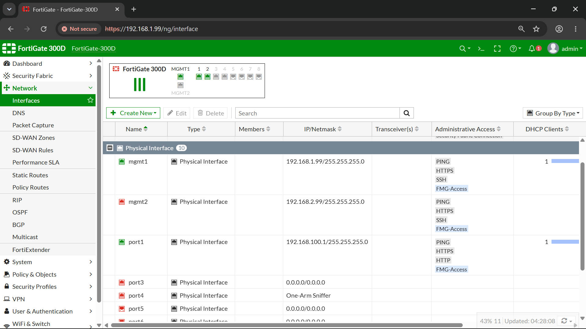
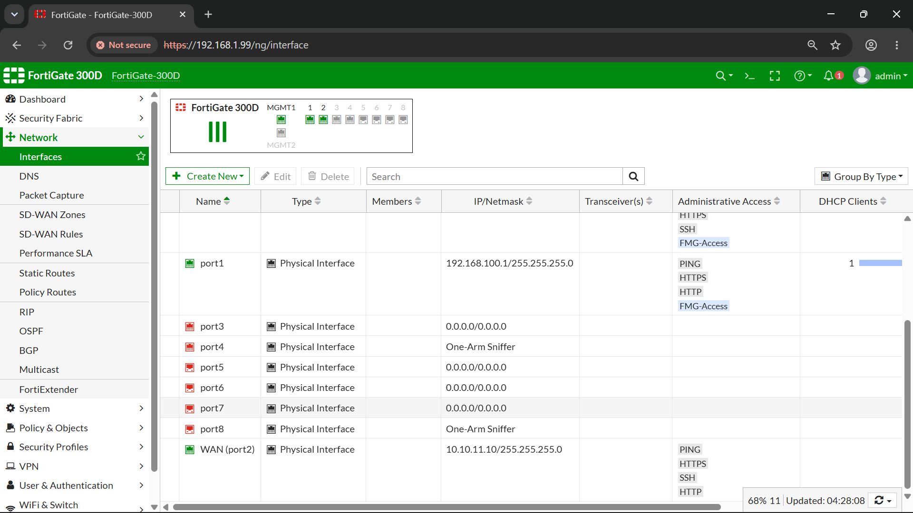
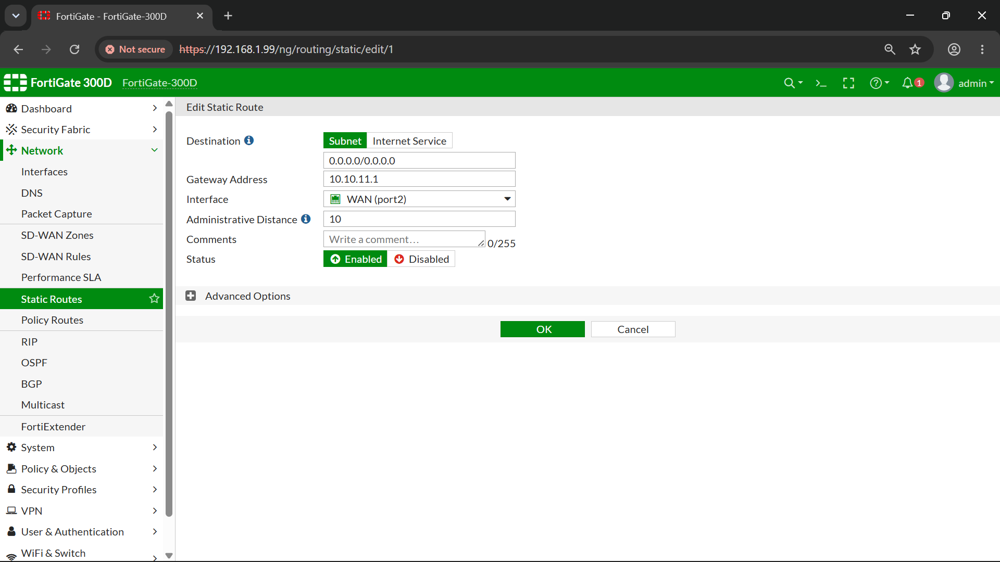
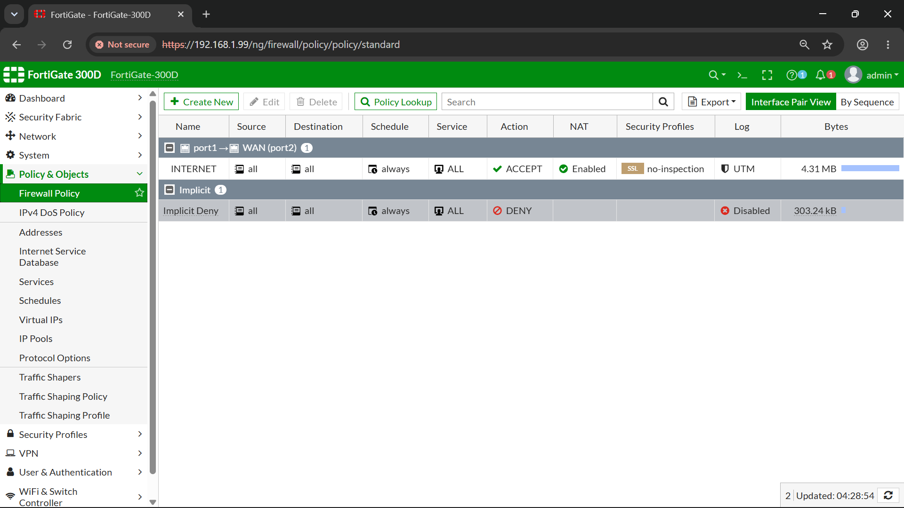
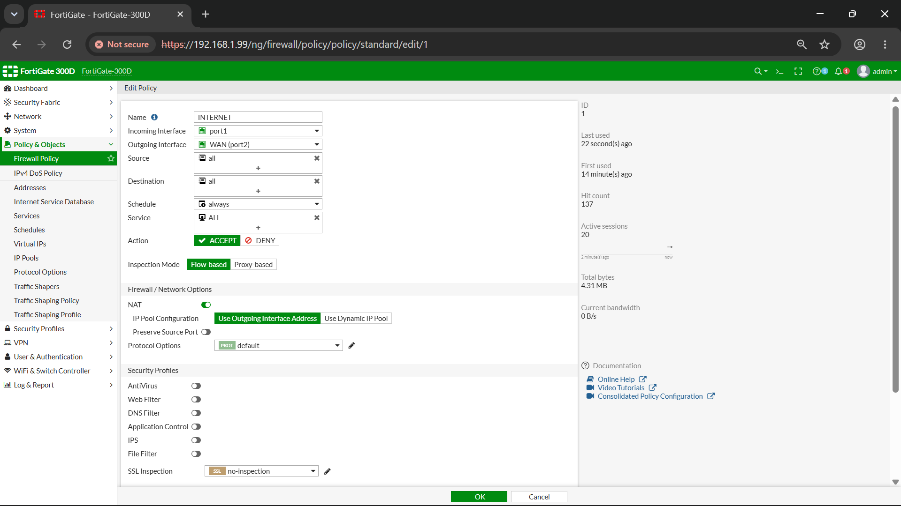

# Bringing Up the FortiGate 300D

Every other real-hardware writeup in this portfolio has been about a switch or a router — the Cisco 1921 ISR, the Catalyst 3560-CX. This one's different. This time the box on the bench was a FortiGate 300D, a next-gen firewall, and instead of CLI commands scrolling past in a terminal, the whole job got done through a browser.

## Network Topology

### Zone Summary

| Zone | Interface | IP Address | Connected To | Purpose |
|---|---|---|---|---|
| RED (WAN) | port2 | 10.10.11.108/24 | Lab-Router (10.10.11.1/24) | Internet / upstream |
| GREEN (LAN) | port1 | 192.168.100.1/24 | End-User-PC | Internal network |
| Management | mgmt1 | 192.168.1.99/24 | Admin-PC (192.168.1.100/24) | GUI/HTTP access |

**Traffic flow:** LAN clients (GREEN) → FortiGate (NAT/policy) → Lab-Router (RED) → Internet

## Powering On and First Contact

It started the simplest way any network device does — power it on, plug in, see what happens. I connected an end device straight into the management port and waited. A few seconds later the device had an IP, handed out automatically by the FortiGate itself, with the default gateway sitting at `192.168.1.99`. That gateway address was the giveaway — it meant the firewall was alive, reachable, and already acting as a DHCP server on its own management segment before I'd touched a single setting.

So I did the obvious thing: typed `192.168.1.99` into a browser and hit enter.

HTTPS, a login prompt, nothing fancy. Logged in, and the GUI dashboard came up.

That dashboard is the box introducing itself — hostname, mode, uptime, licensing status. It's the GUI equivalent of the banner you'd see after logging into a router over console, except here everything is laid out as widgets instead of scrolling text.

## Carving Out LAN and WAN

With access sorted, the next job was deciding which physical ports would face the inside network and which would face the outside world. On a router, this is `interface GigabitEthernet0/0` followed by an IP address and a `no shutdown`. Here, it's clicking into the interface list and assigning roles and addresses through a form.

One port got set up as the LAN-facing side (GREEN zone), holding the internal network's gateway address. Another became the WAN interface (RED zone), carrying the address that would face upstream toward the lab router. Functionally this is identical to configuring two router interfaces with IP addresses and directions — the difference is entirely in *how* you tell the device what you want, not *what* you're telling it.

## Pointing It Somewhere: The Static Route

An interface with an IP address doesn't know how to get anywhere beyond its own subnet until you tell it. On a router this is a one-liner: `ip route 0.0.0.0 0.0.0.0 <next-hop>`. On the FortiGate, it's the same concept dressed up as a form — destination, gateway, outgoing interface, distance.

A default route pointing out through the WAN interface, aimed at the lab router's gateway address. Same logic as CLI static routing, just typed into fields instead of a command line.

## Writing the Policy

This is the part that a plain router doesn't really have an equivalent for — a firewall policy. It's not just "route traffic," it's "decide whether traffic is even allowed to go, and what happens to its source address on the way out."

I built a single policy allowing traffic from the GREEN side out through the RED interface, with NAT switched on so outbound traffic gets translated to the WAN interface's address before it leaves — the GUI version of a `ip nat inside source` style overload rule on a router. Below that policy sits FortiOS's implicit deny, which exists whether you configure it or not — anything not explicitly permitted gets dropped by default. It had already logged dropped traffic on its own, which was a good sign the enforcement was actually working rather than just sitting there configured but inert.

With the route and the policy both in place, the LAN side had a working, static path out to the internet — a fixed address in, a policy allowing it, a route pointing the way.

## From Static to Dynamic: Turning On DHCP

Static addressing on the internal side works, but it doesn't scale — nobody wants to hand-configure every laptop that joins a network. So the last step was flipping on the DHCP server on the LAN-facing interface.

Once that was enabled, a connected client stopped needing a manual IP altogether — it just asked, and the FortiGate answered, the same way it had handed out that very first management-port address back at the start of all this.

## What I Learned

- Zone-based thinking (RED/WAN vs GREEN/LAN vs Management) maps directly onto the interface-role concept from router labs — it's the same "which side is trusted, which side isn't" question, just given explicit color-coded names.
- A firewall policy is doing two jobs at once that a router usually splits across separate features: access control (allow/deny) and NAT, bundled into a single rule.
- The implicit deny at the bottom of the policy table isn't optional or something you configure — it's always there, and watching it actually log dropped traffic was proof the enforcement was live, not just present on paper.
- Flipping from a static, hand-typed IP to a DHCP-served one is a one-toggle change on the LAN interface — the underlying routing and policy don't care how a client got its address, only that it's on the right subnet.
- GUI-based configuration and CLI-based configuration are two skins over the same underlying concepts. The router labs built the mental model; this lab was proof that model transfers the moment the interface changes from a terminal to a browser.

## Interview Questions

**Q: What's the difference between a traditional firewall and a next-gen firewall (NGFW)?**
A: A traditional firewall filters based on ports, protocols, and IP addresses. An NGFW adds deeper inspection on top of that — application awareness, intrusion prevention, web filtering, SSL inspection — so it can make decisions based on *what* the traffic actually is, not just where it's going.

**Q: Why does a firewall policy need NAT in addition to just allowing traffic?**
A: Without NAT, internal private addresses would be sent straight upstream, which the internet wouldn't be able to route back to. NAT translates the internal source address to the firewall's own public-facing address, so return traffic knows where to come back to.

**Q: What happens to traffic that doesn't match any configured policy?**
A: It hits the implicit deny rule, which exists by default on FortiOS regardless of what you've configured. Anything not explicitly permitted gets dropped — a fail-closed default rather than fail-open.

**Q: Why separate a management interface from the LAN and WAN interfaces?**
A: Keeping admin access on its own dedicated interface means device management traffic never mixes with production LAN or WAN traffic — reducing the attack surface, since GUI/SSH access isn't exposed on interfaces facing untrusted networks.

**Q: If a router and a firewall can both route traffic and do NAT, what's actually different between them?**
A: A router's core job is moving packets between networks as efficiently as possible. A firewall's core job is deciding whether packets *should* move at all, and inspecting them along the way. Routing and NAT exist on both, but on a firewall they sit underneath a policy engine built around access control first.
