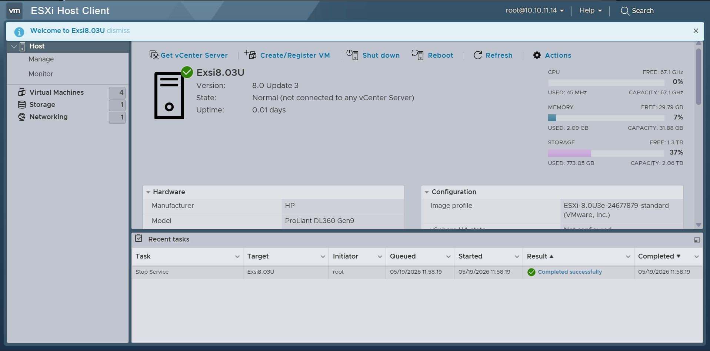
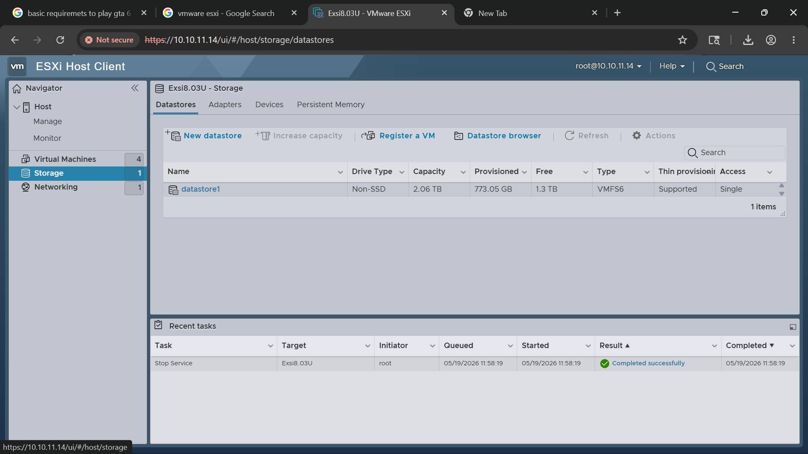

# Network & Infrastructure Engineering Portfolio

Hands-on infrastructure, virtualisation, Windows Server, networking, and troubleshooting labs built during enterprise training at **Vatanix Technologies, Trichy**.

**Georgin Shaju** | BTech CS&E | Diploma in Network Engineering (NACTET)
📧 georginparackal@gmail.com | 🔗 [LinkedIn](https://www.linkedin.com/in/georginshaju)

---

## What This Repository Documents

- VMware ESXi 8.0 deployment on a physical HPE ProLiant DL360 Gen9 enterprise server
- Windows Server 2019 administration — roles, services, and domain management
- Active Directory Domain Services — DC promotion, OUs, users, groups, domain join
- DNS with forward and reverse lookup zones, PTR records, and nslookup verification
- DHCP server configuration and client IP assignment
- Group Policy Objects — logon banners, wallpaper enforcement, desktop restrictions
- Cisco networking labs — VLANs, OSPF, STP, ACLs (in progress)
- Structured troubleshooting using OSI layer-by-layer methodology

---

## Lab Architecture

```
Physical Server: HPE ProLiant DL360 Gen9
├── CPU        : 2x Intel Xeon E5-2680 v4 @ 2.40GHz (28 vCPUs total)
├── RAM        : ~32 GB
├── Storage    : ~2 TB VMFS6 Datastore
├── Management : HPE iLO 4
└── Hypervisor : VMware ESXi 8.0 Update 3

Virtual Machines
├── windows-server-2019  [150 GB] — Domain Controller (AD DS, DNS, DHCP)
└── client-vm            [150 GB] — Domain-joined client

Network
├── ESXi Management IP : 10.10.11.14 (Static)
├── DNS Server         : 10.10.11.1
└── Default Gateway    : 10.10.11.1
```

---

## Key Lessons Learned

- Hardware troubleshooting starts at Layer 1 — always verify physical connections first
- Port identification matters — iLO and standard NIC ports look identical; wrong port = no connectivity
- DNS misconfiguration breaks many Windows services — reverse lookup zones are not optional
- PTR records are required for proper nslookup resolution
- VMXNET3 improves VM networking performance significantly over emulated E1000
- VMware Tools must be installed immediately after OS install — many features depend on it
- Group Policy requires `gpupdate /force` and a restart to apply fully on client machines

---

## Lab in Action

### Physical Server — HPE ProLiant DL360 Gen9

> Front panel with ProLiant badge and status LEDs


> Internal view — dual CPU heatsinks, RAM slots, hot-swap fans


---

### VMware ESXi 8.0 — Bare-Metal Hypervisor

> ESXi boot screen — 2x Xeon E5-2680 v4, ~32 GB RAM on physical server


> ESXi Host Client login — accessed via browser at https://10.10.11.14


> ESXi dashboard — VMs running, ~32 GB RAM, ~2 TB storage



> Virtual Machines deployed and running


> Storage — ~2 TB VMFS6 datastore configured



> Hardware details — 28 vCPUs, network config, BIOS version


---

## Projects

| # | Project | Description | Status |
|---|---|---|---|
| 1 | [Windows Server & ESXi Lab](./Windows_Server/) | Full enterprise server setup — ESXi on HPE ProLiant, Windows Server 2019, AD DS, DNS, DHCP, GPO | ✅ Complete |
| 2 | [Cisco Networking Labs](./Cisco_Labs/) | VLANs, OSPF, STP, ACLs in Packet Tracer and GNS3 | 🔄 In Progress |
| 3 | [Troubleshooting Cases](./Troubleshooting_Cases/) | Structured troubleshooting using OSI layer-by-layer methodology | 🔄 In Progress |

---

## Skills

| Category | Tools & Technologies |
|---|---|
| **Virtualisation** | VMware ESXi 8.0, vSphere Host Client, VM deployment |
| **Server Hardware** | HPE ProLiant DL360 Gen9, iLO 4, hardware RAID |
| **Windows Server** | Windows Server 2019, AD DS, DNS, DHCP, GPO, Domain Controller |
| **Networking** | TCP/IP, IPv4/IPv6, Subnetting, VLANs, OSPF, STP, ACLs |
| **Linux** | Ubuntu Server, networking commands, firewall, log analysis |
| **Security** | SOC Fundamentals, MITRE ATT&CK, Cyber Kill Chain, BitLocker, TPM |
| **Tools** | GNS3, Packet Tracer, Wireshark, Zabbix, Rufus, draw.io |

---

## Certifications

- SOC Fundamentals — Security Blue Team
- MITRE ATT&CK Framework
- Cyber Kill Chain
- CCNA — Cisco Networking Academy

---

> 🔧 Actively built during a 60-day Network & Hardware training program at Vatanix Technologies, Trichy. Real hardware, real labs, real documentation — updated regularly.
