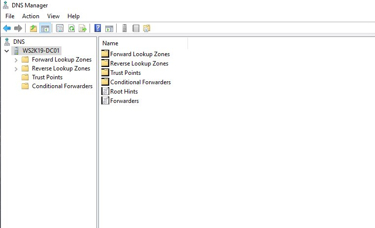
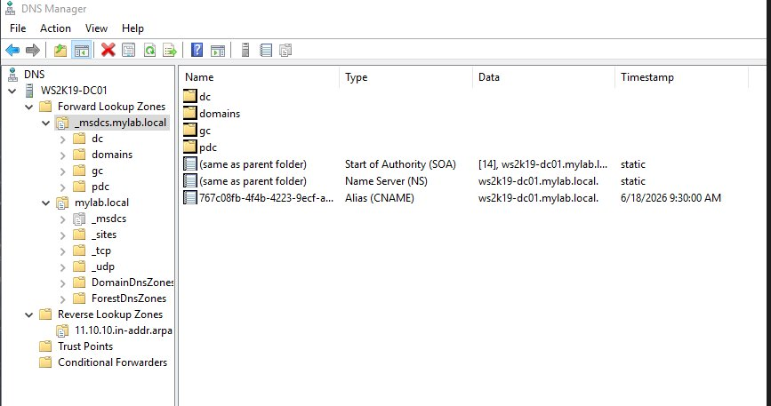
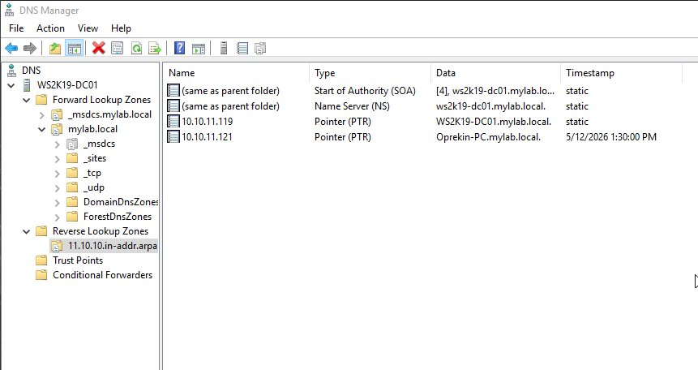
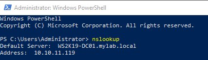

# Lab 03 — DNS Server Configuration on Windows Server 2019

**Topics:** DNS · Forward Lookup Zone · Reverse Lookup Zone · A Records · PTR Records · SRV Records · nslookup

---

## Objective

Configure the DNS Server role on Windows Server 2019. Create forward and reverse lookup
zones, verify A records and PTR records, and confirm name resolution using `nslookup`
from a PowerShell session on the domain-joined client.

---

## Environment

| Component | Detail |
|-----------|--------|
| Server Hostname | WS2K19-DC01 |
| Domain | mylab.local |
| Server IP | 10.10.11.119 |
| Client IP | 10.10.11.121 (Oprekin-PC) |

> DNS was installed automatically alongside AD DS during Domain Controller promotion.
> The steps below cover zone verification, PTR record creation, and resolution testing.

---

## Key Concepts

**Forward Lookup Zone** resolves hostname → IP address. Most DNS queries are forward lookups.

**Reverse Lookup Zone** resolves IP address → hostname. Required for reverse `nslookup`,
PTR record verification, and several Windows Server services.

**A Record** maps a hostname to an IPv4 address inside a forward lookup zone.

**PTR Record (Pointer Record)** maps an IP address back to a hostname inside the reverse
lookup zone. Without PTR records, reverse DNS lookups fail.

**SRV Records** are automatically registered by AD DS. Client machines use these to locate
the DC for authentication — they are critical for domain function.

---

## Configuration Steps

---

### STEP 1 — Open DNS Manager

```
Server Manager → Tools → DNS
```

The DNS Manager shows both Forward Lookup Zones and Reverse Lookup Zones on
WS2K19-DC01.



> After DC promotion, DNS Manager is populated with both zones and the full
> AD-integrated record set. This confirms DNS is running and both zones exist.

---

### STEP 2 — Verify Forward Lookup Zone

```
DNS Manager → Forward Lookup Zones → mylab.local
```



The `_msdcs.mylab.local` zone contains the AD service records registered automatically
during DC promotion. Inside `mylab.local` the following are confirmed present:

| Record | Type | Data |
|--------|------|------|
| (same as parent) | SOA | ws2k19-dc01.mylab.local |
| (same as parent) | NS | ws2k19-dc01.mylab.local |
| 767c08fb-... | CNAME (Alias) | ws2k19-dc01.mylab.local |

The SOA and NS records confirm this DC is the authoritative DNS server for the domain.
The CNAME under `_msdcs` is the DC's GUID-based alias registered by AD DS automatically.

> If the A record for WS2K19-DC01 is missing, run `ipconfig /registerdns` on the DC.

---

### STEP 3 — Create the Reverse Lookup Zone

```
DNS Manager → Right-click Reverse Lookup Zones → New Zone
→ Zone Type     : Primary Zone
→ Network ID    : 10.10.11
  (zone name auto-fills as 11.10.10.in-addr.arpa)
→ Dynamic Updates : Allow only secure dynamic updates
→ Finish
```

> **Why `in-addr.arpa`?** This is the reserved DNS domain for reverse lookups.
> IP addresses are written in reverse — so `10.10.11.119` is looked up as
> `119.11.10.10.in-addr.arpa`.

---

### STEP 4 — Verify PTR Records in Reverse Lookup Zone

```
DNS Manager → Reverse Lookup Zones → 11.10.10.in-addr.arpa
```



| Record | Type | Data |
|--------|------|------|
| (same as parent) | SOA | ws2k19-dc01.mylab.local |
| (same as parent) | NS | ws2k19-dc01.mylab.local |
| 10.10.11.119 | PTR | WS2K19-DC01.mylab.local |
| 10.10.11.121 | PTR | Oprekin-PC.mylab.local |

Both the DC (119) and the client (121) have PTR records — reverse resolution will
work for both machines.

> If PTR records are missing, add manually: Right-click reverse zone → New Pointer (PTR)
> → enter the last octet and the FQDN.

---

### STEP 5 — Verify DNS Resolution from Client (PowerShell)

On the domain-joined client (Oprekin-PC), open PowerShell as Administrator:

```powershell
nslookup
```



The nslookup prompt confirms:

```
Default Server:  WS2K19-DC01.mylab.local
Address:         10.10.11.119
```

This means the client is correctly using `WS2K19-DC01` at `10.10.11.119` as its
DNS server — the domain controller is resolving all queries.

---

### STEP 6 — Additional nslookup Verification Commands

Run these from the client to fully verify DNS:

```cmd
# Forward lookup — hostname to IP
nslookup WS2K19-DC01.mylab.local

# Reverse lookup — IP to hostname
nslookup 10.10.11.119

# Verify AD SRV records (critical for domain authentication)
nslookup -type=SRV _ldap._tcp.mylab.local
nslookup -type=SRV _kerberos._tcp.mylab.local
```

Expected forward lookup output:
```
Server:  WS2K19-DC01.mylab.local
Address: 10.10.11.119

Name:    WS2K19-DC01.mylab.local
Address: 10.10.11.119
```

---

## Verification Summary

| Check | Command | Expected |
|-------|---------|----------|
| DNS server in use | `nslookup` | Default Server: WS2K19-DC01.mylab.local |
| Forward lookup | `nslookup WS2K19-DC01.mylab.local` | 10.10.11.119 |
| Reverse lookup | `nslookup 10.10.11.119` | WS2K19-DC01.mylab.local |
| PTR records | DNS Manager → Reverse Zone | 119 and 121 both mapped |
| LDAP SRV | `nslookup -type=SRV _ldap._tcp.mylab.local` | DC hostname |
| Kerberos SRV | `nslookup -type=SRV _kerberos._tcp.mylab.local` | DC hostname |

---

## Common Issues and Fixes

| Problem | Cause | Fix |
|---------|-------|-----|
| Reverse lookup fails | Reverse zone not created | Create `11.10.10.in-addr.arpa` zone manually |
| PTR record missing | Box not checked during A record creation | Add PTR manually in reverse zone |
| nslookup queries wrong server | Client DNS not set to DC IP | Set client DNS adapter to 10.10.11.119 |
| SRV records missing | AD registration not complete | Run `ipconfig /registerdns` on DC |
| nslookup returns old IP | DNS cache not cleared | Run `ipconfig /flushdns` on client |

---

## Lessons Learned

- AD DS creates the forward lookup zone automatically during DC promotion — the reverse zone must be created manually
- Always check "Create associated PTR record" when adding A records to avoid manual PTR creation later
- SRV records are what allow clients to locate the DC for Kerberos and LDAP — always verify after DC promotion
- The `nslookup` default server line confirms which DNS server the client is querying — first thing to check when DNS seems broken
- DNS problems surface as AD errors — when troubleshooting domain issues, always check DNS first
