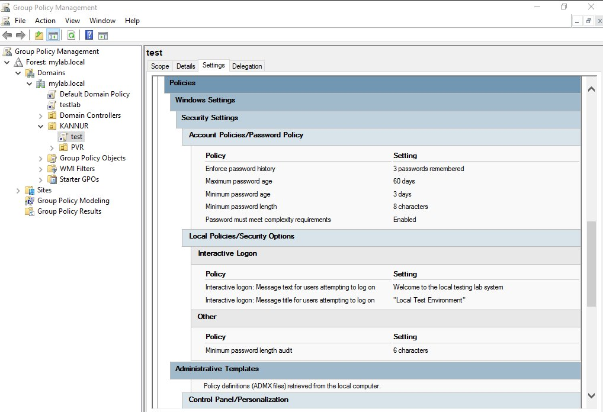
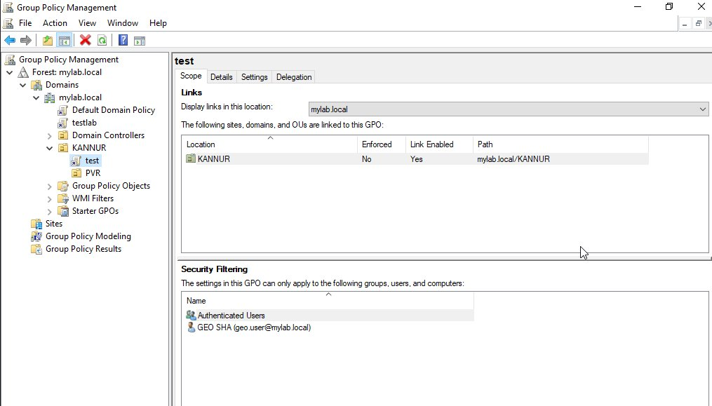

# Lab 05 — Group Policy Objects (GPO) Configuration

**Topics:** GPO · GPMC · Password Policy · Logon Banner · Wallpaper Enforcement · OU Linking · Security Filtering · gpupdate · gpresult

---

## Objective

Create and apply a Group Policy Object in the `mylab.local` Active Directory domain.
Configure a password policy, logon warning banner, and desktop wallpaper enforcement.
Link the GPO to the KANNUR OU and verify it applies to a specific user account using
security filtering.

---

## Environment

| Component | Detail |
|-----------|--------|
| Domain | mylab.local |
| DC Hostname | WS2K19-DC01 |
| GPO Name | test |
| Linked OU | KANNUR |
| Target User | GEO SHA (geo.user@mylab.local) |
| Client | Oprekin-PC.mylab.local |

---

## Key Concepts

**Group Policy Object (GPO)** is a collection of settings that control user and computer
accounts in AD — enforcing security settings, desktop appearance, and restrictions from
one central location.

**Computer Configuration** applies when the machine starts, regardless of who logs in.
Use for hardware-level and security baseline settings.

**User Configuration** applies when a specific user logs in. Use for desktop settings,
logon scripts, and interface restrictions.

**Security Filtering** controls which users or computers a GPO applies to. By default
all Authenticated Users are in scope — adding a specific user alongside narrows or
documents the intended target.

**gpupdate /force** manually triggers an immediate Group Policy refresh on the client
instead of waiting for the default 90-minute background refresh.

---

## Configuration Steps

---

### STEP 1 — Open Group Policy Management Console

```
Server Manager → Tools → Group Policy Management
```

The GPMC tree shows:
```
Forest: mylab.local
└── Domains
    └── mylab.local
        ├── Default Domain Policy
        ├── testlab
        ├── Domain Controllers
        └── KANNUR
            ├── test   ← GPO created in this lab
            └── PVR
```

---

### STEP 2 — Create a New GPO and Link to KANNUR OU

```
Right-click KANNUR OU → Create a GPO in this domain and Link it here
Name: test
```

> **Why not edit Default Domain Policy?** Default Domain Policy should only contain
> account and password lockout settings at the domain level. All other settings belong
> in separate named GPOs linked to the appropriate OU — easier to troubleshoot and
> revoke without affecting the whole domain.

---

### STEP 3 — Configure Password Policy

```
Edit GPO: test
Computer Configuration
→ Policies → Windows Settings → Security Settings
→ Account Policies → Password Policy

  Enforce password history    : 3 passwords remembered
  Maximum password age        : 60 days
  Minimum password age        : 3 days
  Minimum password length     : 8 characters
  Password must meet complexity: Enabled
```



The Settings tab confirms all five password policies are applied, plus the Interactive
Logon banner text is set to "Welcome to the local testing lab system" with title
"Local Test Environment".

---

### STEP 4 — Configure Logon Warning Banner

```
Edit GPO: test
Computer Configuration
→ Policies → Windows Settings → Security Settings
→ Local Policies → Security Options

  Interactive logon: Message title for users attempting to log on
  Value: "Local Test Environment"

  Interactive logon: Message text for users attempting to log on
  Value: Welcome to the local testing lab system
```

> **Why:** A logon banner is a legal notice required in most enterprise and regulated
> environments. Without it, legal action against unauthorised access is weakened.

---

### STEP 5 — Enforce Desktop Wallpaper

```
Edit GPO: test
User Configuration
→ Policies → Administrative Templates → Desktop → Desktop

  Desktop Wallpaper: Enabled
  Wallpaper Name  : \\mylab.local\NETLOGON\wallpaper.jpg
  Wallpaper Style : Fill
```

Before assigning the wallpaper path, copy the image file to the NETLOGON share:

```
Copy wallpaper.jpg to:
C:\Windows\SYSVOL\sysvol\mylab.local\scripts\wallpaper.jpg

This makes it available at:
\\mylab.local\NETLOGON\wallpaper.jpg
```

> **Why NETLOGON?** The NETLOGON share is automatically available on every DC and
> accessible to all domain users at login — no additional share configuration needed.

---

### STEP 6 — Verify GPO Link to KANNUR OU

```
GPMC → mylab.local → KANNUR → test → Scope tab
```



The Scope tab confirms:

| Field | Value |
|-------|-------|
| Location | KANNUR |
| Enforced | No |
| Link Enabled | Yes |
| Path | mylab.local/KANNUR |

Security Filtering shows both `Authenticated Users` and `GEO SHA (geo.user@mylab.local)`
— the GPO applies to all authenticated domain users in the KANNUR OU, with GEO SHA
specifically added for targeted verification.

---

### STEP 7 — Apply and Verify on Client

On the domain-joined client (Oprekin-PC), open Command Prompt as Administrator:

```cmd
gpupdate /force
```

Then restart the client. After login, verify:

| Policy | How to Verify |
|--------|--------------|
| Logon banner | Log out — "Local Test Environment" title appears before password prompt |
| Wallpaper | Right-click desktop → Personalise — wallpaper is locked |
| Password policy | Attempt to set a password shorter than 8 characters — rejected |

```cmd
# Full GP report on client
gpresult /r

# Detailed HTML report
gpresult /h C:\gpreport.html
```

> `gpresult /r` will show the GPO name "test" in the Applied GPOs list under both
> Computer Settings and User Settings sections if applied correctly.

---

## Verification Summary

| Check | Method | Expected Result |
|-------|--------|----------------|
| GPO linked to OU | GPMC Scope tab | KANNUR — Link Enabled: Yes |
| Password policy active | GPO Settings tab | 8 char min, 60 day max, complexity enabled |
| Logon banner text | GPO Settings tab | "Welcome to the local testing lab system" |
| GPO applied on client | `gpresult /r` | "test" in Applied GPOs list |
| Logon banner on client | Log out and back in | Banner title and text appear |

---

## Common Issues and Fixes

| Problem | Cause | Fix |
|---------|-------|-----|
| Policy not applying after gpupdate | Computer Config requires restart | Restart client after `gpupdate /force` |
| Wallpaper not enforced | Wrong UNC path or file missing from SYSVOL | Verify `\\mylab.local\NETLOGON\wallpaper.jpg` exists |
| GPO not in gpresult | GPO linked to wrong OU | Check link location in GPMC Scope tab |
| Password policy not enforced | GPO not applied to computer account | Confirm computer object is in the KANNUR OU |
| Logon banner not appearing | Policy set in User Config instead of Computer Config | Move Interactive Logon settings to Computer Configuration |

---

## Lessons Learned

- Never add custom settings to Default Domain Policy — always create separate named GPOs linked to the right OU
- Computer Configuration applies at boot; User Configuration applies at login — choose the correct scope for each setting
- `gpupdate /force` does not apply all settings immediately — Computer Configuration always requires a restart
- Security Filtering lets you target a GPO at specific users or computers without changing the OU structure
- `gpresult /r` is the first tool to open when a policy is not applying as expected
- The logon banner must be in Computer Configuration to appear before the login prompt — User Configuration is too late
